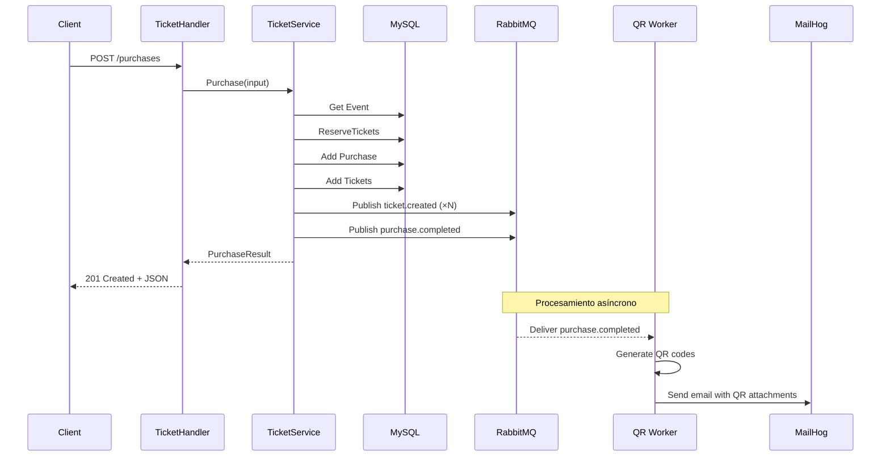

# Referencia de la Ticket API

**URL base:** `http://localhost:8080`

La Ticket API gestiona eventos, compras y el ciclo de vida de las entradas.

---

## Autenticación

La mayoría de los endpoints requieren un JWT válido de AWS Cognito en el header `Authorization`:

```
Authorization: Bearer <access_token_or_id_token>
```

Los tokens se validan contra el endpoint JWKS del User Pool de Cognito (`RS256`). La autorización por rol se basa en la pertenencia a grupos de Cognito:

| Endpoint | Rol requerido |
|---|---|
| `GET /events` | — (público) |
| `GET /events/{id}` | — (público) |
| `POST /events` | `admin` |
| `POST /purchases` | `user` |
| `POST /tickets/lookup` | cualquier usuario autenticado |
| `POST /tickets/cancel` | `admin` |

| Código HTTP | Significado |
|---|---|
| `401` | JWT ausente, malformado o expirado |
| `403` | JWT válido pero el usuario no tiene el rol requerido |

---

## Resumen de endpoints

| Método | Path | Auth | Descripción |
|---|---|---|---|
| `GET` | `/events` | Ninguna | Listar todos los eventos |
| `GET` | `/events/{id}` | Ninguna | Obtener evento por ID |
| `POST` | `/events` | admin | Crear un nuevo evento |
| `POST` | `/purchases` | user | Comprar entradas para un evento |
| `POST` | `/tickets/lookup` | autenticado | Obtener detalles de una entrada por código |
| `POST` | `/tickets/cancel` | admin | Cancelar una entrada |
| `GET` | `/metrics` | Ninguna | Endpoint de métricas Prometheus |

---

## GET /events

Retorna todos los eventos ordenados por fecha ascendente. No requiere autenticación.

### Respuesta — 200 OK

```json
[
  {
    "id": 1,
    "name": "Rock Festival 2026",
    "location": "Luna Park, Buenos Aires",
    "date": "2026-07-15T20:00:00Z",
    "capacity": 5000,
    "available_tickets": 4850,
    "ticket_price": 150.00
  }
]
```

Retorna un array vacío `[]` si no hay eventos.

---

## GET /events/{id}

Retorna un único evento por su ID. No requiere autenticación.

### Parámetros

| Parámetro | En | Tipo | Descripción |
|---|---|---|---|
| `id` | path | `int` | ID del evento |

### Respuesta — 200 OK

```json
{
  "id": 1,
  "name": "Rock Festival 2026",
  "location": "Luna Park, Buenos Aires",
  "date": "2026-07-15T20:00:00Z",
  "capacity": 5000,
  "available_tickets": 4850,
  "ticket_price": 150.00
}
```

### Errores

| Estado | Motivo |
|---|---|
| `400` | ID de evento inválido (no entero) |
| `404` | Evento no encontrado |
| `500` | Error interno del servidor |

---

## POST /events

Crear un nuevo evento con información del lugar y capacidad de entradas.

### Cuerpo del request

```json
{
  "name": "Rock Festival 2026",
  "location": "Luna Park, Buenos Aires",
  "date": "2026-07-15T20:00:00Z",
  "capacity": 5000,
  "ticket_price": 150.00
}
```

| Campo | Tipo | Requerido | Descripción |
|---|---|---|---|
| `name` | `string` | Sí | Nombre del evento |
| `location` | `string` | Sí | Nombre o dirección del lugar |
| `date` | `string` (RFC3339) | Sí | Fecha y hora del evento |
| `capacity` | `int` | Sí | Número máximo de entradas (debe ser > 0) |
| `ticket_price` | `float` | Sí | Precio por entrada (debe ser > 0) |

### Respuesta — 201 Created

```json
{
  "id": 42,
  "name": "Rock Festival 2026",
  "location": "Luna Park, Buenos Aires",
  "date": "2026-07-15T20:00:00Z",
  "capacity": 5000,
  "ticket_price": 150.00
}
```

El campo `id` es el ID auto-incremental generado por la base de datos al persistir el evento.

### Errores

| Estado | Motivo |
|---|---|
| `400` | Campos ausentes o inválidos |
| `401` | JWT ausente o inválido |
| `403` | El usuario no pertenece al grupo `admin` |
| `500` | Error interno del servidor |

---

## POST /purchases

Comprar una o más entradas para un evento. La generación del QR y el envío del email son procesados de forma asíncrona por el **QR Worker** mediante un evento `purchase.completed`.

### Cuerpo del request

```json
{
  "buyer_email": "john@example.com",
  "event_id": 1,
  "quantity": 3
}
```

| Campo | Tipo | Requerido | Descripción |
|---|---|---|---|
| `buyer_email` | `string` | Sí | Email del comprador para entrega de entradas |
| `event_id` | `int` | Sí | ID del evento para el que se compran las entradas |
| `quantity` | `int` | Sí | Cantidad de entradas (debe ser > 0) |

### Respuesta — 201 Created

```json
{
  "purchase_id": 1,
  "event_name": "Rock Festival 2026",
  "buyer_email": "john@example.com",
  "quantity": 3,
  "total_price": 450.00,
  "tickets": [
    {
      "id": 1,
      "code": "a1b2c3d4-e5f6-7890-abcd-ef1234567890",
      "status": "emitted"
    },
    {
      "id": 2,
      "code": "b2c3d4e5-f6a7-8901-bcde-f12345678901",
      "status": "emitted"
    },
    {
      "id": 3,
      "code": "c3d4e5f6-a7b8-9012-cdef-123456789012",
      "status": "emitted"
    }
  ]
}
```

### Efectos secundarios

1. **Evento publicado** — Se publica un evento `ticket.created` por entrada en RabbitMQ (consumido por el Validator)
2. **Evento publicado** — Se publica un evento `purchase.completed` en RabbitMQ (consumido por el QR Worker)
3. **Generación de QR** — El QR Worker genera un token firmado con HMAC por código de entrada y lo codifica como imagen QR (asíncrono)
4. **Envío de email** — El QR Worker envía un email de confirmación con los QR adjuntos a `buyer_email` (asíncrono)

!!! note "Tokens QR firmados con HMAC"
    El código QR no contiene el UUID en crudo. En su lugar, el QR Worker firma cada código de entrada usando HMAC-SHA256, produciendo un token con el formato `code.signature`. La Validator API verifica esta firma antes de procesar la entrada.

### Errores

| Estado | Motivo |
|---|---|
| `400` | Cuerpo inválido o capacidad insuficiente |
| `401` | JWT ausente o inválido |
| `403` | El usuario no pertenece al grupo `user` |
| `404` | Evento no encontrado |
| `500` | Error interno del servidor |

---

## POST /tickets/lookup

Obtener los detalles de una entrada por su código UUID. El código se envía en el cuerpo del request (no en la URL) por seguridad.

### Cuerpo del request

```json
{
  "code": "a1b2c3d4-e5f6-7890-abcd-ef1234567890"
}
```

| Campo | Tipo | Requerido | Descripción |
|---|---|---|---|
| `code` | `string` | Sí | Código UUID de la entrada |

### Respuesta — 200 OK

```json
{
  "id": 1,
  "code": "a1b2c3d4-e5f6-7890-abcd-ef1234567890",
  "status": "emitted"
}
```

### Errores

| Estado | Motivo |
|---|---|
| `400` | Código ausente o vacío |
| `401` | JWT ausente o inválido |
| `404` | Entrada no encontrada |
| `500` | Error interno del servidor |

---

## POST /tickets/cancel

Cancelar una entrada por código. Solo se pueden cancelar entradas en estado `emitted`. El código se envía en el cuerpo del request (no en la URL) por seguridad.

### Cuerpo del request

```json
{
  "code": "a1b2c3d4-e5f6-7890-abcd-ef1234567890"
}
```

| Campo | Tipo | Requerido | Descripción |
|---|---|---|---|
| `code` | `string` | Sí | Código UUID de la entrada |

### Respuesta — 200 OK

```json
{
  "message": "ticket cancelled"
}
```

### Efectos secundarios

1. **Actualización de estado** — El estado de la entrada cambia de `emitted` a `cancelled`
2. **Evento publicado** — Se publica un evento `ticket.cancelled` en RabbitMQ

### Errores

| Estado | Motivo |
|---|---|
| `400` | Código ausente o vacío |
| `401` | JWT ausente o inválido |
| `403` | El usuario no pertenece al grupo `admin` |
| `404` | Entrada no encontrada |
| `409` | La entrada no está en estado `emitted` |
| `500` | Error interno del servidor |

---

## Diagrama de flujo de requests


