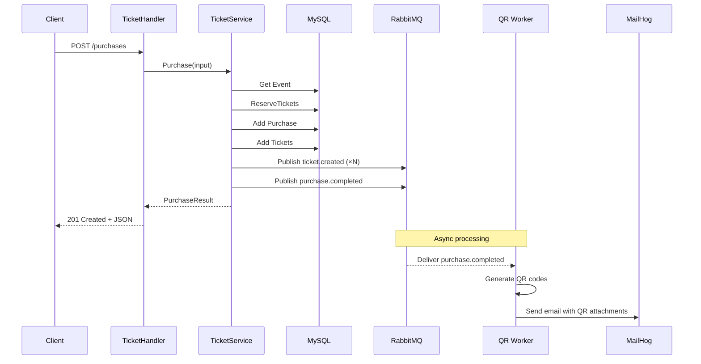

# Ticket API Reference

**Base URL:** `http://localhost:8080`

The Ticket API manages events, purchases, and ticket lifecycle operations.

---

## Authentication

Most endpoints require a valid AWS Cognito JWT in the `Authorization` header:

```
Authorization: Bearer <access_token_or_id_token>
```

Tokens are validated against the Cognito User Pool JWKS endpoint (`RS256`). Role enforcement is based on Cognito group membership:

| Endpoint | Required role |
|---|---|
| `GET /events` | — (public) |
| `GET /events/{id}` | — (public) |
| `POST /events` | `admin` |
| `POST /purchases` | `user` |
| `POST /tickets/lookup` | any authenticated |
| `POST /tickets/cancel` | `admin` |

| HTTP status | Meaning |
|---|---|
| `401` | Missing, malformed, or expired JWT |
| `403` | Valid JWT but caller lacks the required role |

---

## Endpoints Overview

| Method | Path | Auth | Description |
|---|---|---|---|
| `GET` | `/events` | None | List all events |
| `GET` | `/events/{id}` | None | Get event by ID |
| `POST` | `/events` | admin | Create a new event |
| `POST` | `/purchases` | user | Purchase tickets for an event |
| `POST` | `/tickets/lookup` | authenticated | Get ticket details by code |
| `POST` | `/tickets/cancel` | admin | Cancel a ticket |
| `GET` | `/metrics` | None | Prometheus metrics endpoint |

---

## GET /events

Returns all events ordered by date ascending. No authentication required.

### Response — 200 OK

```json
[
  {
    "id": 1,
    "name": "Rock Festival 2026",
    "location": "Luna Park, Buenos Aires",
    "date": "2026-07-15T20:00:00Z",
    "capacity": 5000,
    "available_tickets": 4850,
    "ticket_price": 150.00
  }
]
```

Returns an empty array `[]` if there are no events.

---

## GET /events/{id}

Returns a single event by its ID. No authentication required.

### Parameters

| Parameter | In | Type | Description |
|---|---|---|---|
| `id` | path | `int` | Event ID |

### Response — 200 OK

```json
{
  "id": 1,
  "name": "Rock Festival 2026",
  "location": "Luna Park, Buenos Aires",
  "date": "2026-07-15T20:00:00Z",
  "capacity": 5000,
  "available_tickets": 4850,
  "ticket_price": 150.00
}
```

### Errors

| Status | Reason |
|---|---|
| `400` | Invalid (non-integer) event ID |
| `404` | Event not found |
| `500` | Internal server error |

---

## POST /events

Create a new event with venue information and ticket capacity.

### Request Body

```json
{
  "name": "Rock Festival 2026",
  "location": "Luna Park, Buenos Aires",
  "date": "2026-07-15T20:00:00Z",
  "capacity": 5000,
  "ticket_price": 150.00
}
```

| Field | Type | Required | Description |
|---|---|---|---|
| `name` | `string` | Yes | Event name |
| `location` | `string` | Yes | Venue name/address |
| `date` | `string` (RFC3339) | Yes | Event date and time |
| `capacity` | `int` | Yes | Maximum number of tickets (must be > 0) |
| `ticket_price` | `float` | Yes | Price per ticket (must be > 0) |

### Response — 201 Created

```json
{
  "id": 42,
  "name": "Rock Festival 2026",
  "location": "Luna Park, Buenos Aires",
  "date": "2026-07-15T20:00:00Z",
  "capacity": 5000,
  "ticket_price": 150.00
}
```

The `id` field is the database-generated auto-increment ID assigned after the event is persisted.

### Errors

| Status | Reason |
|---|---|
| `400` | Missing or invalid fields |
| `401` | Missing or invalid JWT |
| `403` | Caller is not in the `admin` group |
| `500` | Internal server error |

---

## POST /purchases

Purchase one or more tickets for an event. QR code generation and email delivery are handled asynchronously by the **QR Worker** via a `purchase.completed` event.

### Request Body

```json
{
  "buyer_email": "john@example.com",
  "event_id": 1,
  "quantity": 3
}
```

| Field | Type | Required | Description |
|---|---|---|---|
| `buyer_email` | `string` | Yes | Buyer's email for ticket delivery |
| `event_id` | `int` | Yes | Event ID to purchase tickets for |
| `quantity` | `int` | Yes | Number of tickets (must be > 0) |

### Response — 201 Created

```json
{
  "purchase_id": 1,
  "event_name": "Rock Festival 2026",
  "buyer_email": "john@example.com",
  "quantity": 3,
  "total_price": 450.00,
  "tickets": [
    {
      "id": 1,
      "code": "a1b2c3d4-e5f6-7890-abcd-ef1234567890",
      "status": "emitted"
    },
    {
      "id": 2,
      "code": "b2c3d4e5-f6a7-8901-bcde-f12345678901",
      "status": "emitted"
    },
    {
      "id": 3,
      "code": "c3d4e5f6-a7b8-9012-cdef-123456789012",
      "status": "emitted"
    }
  ]
}
```

### Side Effects

1. **Event Published** — A `ticket.created` event is published per ticket to RabbitMQ (consumed by Validator)
2. **Event Published** — A `purchase.completed` event is published to RabbitMQ (consumed by QR Worker)
3. **QR Code Generation** — The QR Worker generates an HMAC-signed token per ticket code and encodes it as a QR image (async)
4. **Email Delivery** — The QR Worker sends a confirmation email with QR codes to `buyer_email` (async)

!!! note "HMAC-Signed QR Tokens"
    The QR code does not contain the raw UUID. Instead, the QR Worker signs each ticket code using HMAC-SHA256, producing a token in the format `code.signature`. The Validator API verifies this signature before processing.

### Errors

| Status | Reason |
|---|---|
| `400` | Invalid body or insufficient capacity |
| `401` | Missing or invalid JWT |
| `403` | Caller is not in the `user` group |
| `404` | Event not found |
| `500` | Internal server error |

---

## POST /tickets/lookup

Retrieve ticket details by its UUID code. The code is sent in the request body (not in the URL) for security.

### Request Body

```json
{
  "code": "a1b2c3d4-e5f6-7890-abcd-ef1234567890"
}
```

| Field | Type | Required | Description |
|---|---|---|---|
| `code` | `string` | Yes | Ticket UUID code |

### Response — 200 OK

```json
{
  "id": 1,
  "code": "a1b2c3d4-e5f6-7890-abcd-ef1234567890",
  "status": "emitted"
}
```

### Errors

| Status | Reason |
|---|---|
| `400` | Missing or empty code |
| `401` | Missing or invalid JWT |
| `404` | Ticket not found |
| `500` | Internal server error |

---

## POST /tickets/cancel

Cancel a ticket by code. Only `emitted` tickets can be cancelled. The code is sent in the request body (not in the URL) for security.

### Request Body

```json
{
  "code": "a1b2c3d4-e5f6-7890-abcd-ef1234567890"
}
```

| Field | Type | Required | Description |
|---|---|---|---|
| `code` | `string` | Yes | Ticket UUID code |

### Response — 200 OK

```json
{
  "message": "ticket cancelled"
}
```

### Side Effects

1. **Status Update** — Ticket status changes from `emitted` to `cancelled`
2. **Event Published** — A `ticket.cancelled` event is published to RabbitMQ

### Errors

| Status | Reason |
|---|---|
| `400` | Missing or empty code |
| `401` | Missing or invalid JWT |
| `403` | Caller is not in the `admin` group |
| `404` | Ticket not found |
| `409` | Ticket is not in `emitted` status |
| `500` | Internal server error |

---

## Request Flow Diagram


