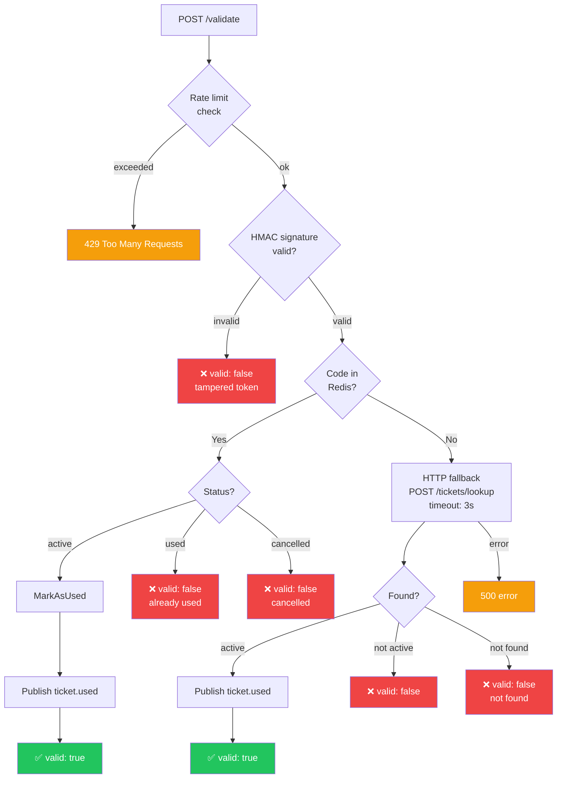
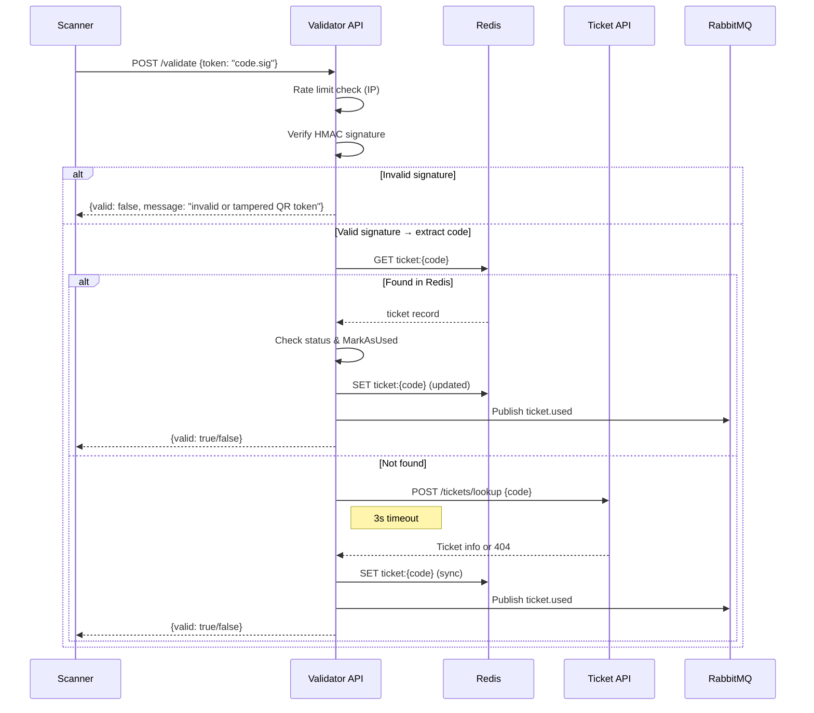

# Referencia de la Validator API

**URL base:** `http://localhost:8081`

La Validator API provee validación de entradas en tiempo real en los puntos de acceso al evento.

!!! info "Autenticación"
    Todos los endpoints requieren un JWT válido de AWS Cognito en el header `Authorization: Bearer <token>`.
    Solo los usuarios del grupo **`admin`** de Cognito pueden validar entradas.
    Un token ausente o inválido devuelve `401`; un token válido sin el grupo `admin` devuelve `403`.

!!! warning "Rate Limiting"
    El endpoint de validación está protegido por **rate limiting por IP** (algoritmo token bucket, 10 req/s con burst de 20). Los clientes que superen el límite reciben una respuesta `429 Too Many Requests` con un header `Retry-After`.

!!! info "Reconciliación bidireccional"
    Ante una validación exitosa, el Validator publica un evento `ticket.used` en RabbitMQ. El Ticket Service consume este evento y marca la entrada como usada en su propia base de datos, manteniendo ambos sistemas sincronizados.

---

## Resumen de endpoints

| Método | Path | Descripción |
|---|---|---|
| `POST` | `/validate` | Validar una entrada por código QR |
| `GET` | `/metrics` | Endpoint de métricas Prometheus |

---

## POST /validate

Validar una entrada mediante su token firmado con HMAC (escaneado del QR). El handler primero verifica la firma HMAC para extraer el código de entrada, luego consulta Redis (camino rápido), y recurre al Ticket Service vía HTTP si no se encuentra localmente.

### Cuerpo del request

```json
{
  "token": "a1b2c3d4-e5f6-7890-abcd-ef1234567890.hmac_signature_hex"
}
```

| Campo | Tipo | Requerido | Descripción |
|---|---|---|---|
| `token` | `string` | Sí | Token firmado con HMAC del escaneo QR (formato `code.signature`) |

### Respuesta — 200 OK (Válida)

```json
{
  "valid": true,
  "message": "ticket validated successfully"
}
```

### Respuesta — 200 OK (Inválida)

```json
{
  "valid": false,
  "message": "ticket already used"
}
```

Posibles mensajes de respuesta inválida:

| Mensaje | Descripción |
|---|---|
| `invalid or tampered QR token` | Falló la verificación de la firma HMAC |
| `ticket is used` | La entrada ya fue escaneada |
| `ticket is cancelled` | La entrada fue revocada |
| `ticket not found` | No existe ninguna entrada con ese código |

### Errores

| Estado | Motivo |
|---|---|
| `400` | Cuerpo ausente o inválido / token vacío |
| `401` | JWT ausente o inválido |
| `403` | El usuario no pertenece al grupo `admin` |
| `429` | Límite de rate excedido (se incluye header Retry-After) |
| `500` | Error interno del servidor (fallo de BD o fallback) |

---

## Estrategia de validación



---

## Patrón de validación en dos niveles

El Validator usa un enfoque de **validación en dos niveles** para máxima disponibilidad:

### Nivel 0: Verificación del token HMAC

- El handler verifica la firma HMAC-SHA256 del token QR escaneado
- Rechaza tokens alterados o falsificados antes de cualquier consulta al almacenamiento
- Rechazo de tokens inválidos a costo cero

### Nivel 1: Redis (camino rápido)

- Los datos de entradas se sincronizan asincrónicamente desde RabbitMQ hacia Redis
- Formato de clave: `ticket:{code}` con valor JSON (`eventID`, `status`, `usedAt`, `syncedAt`)
- Búsquedas O(1) en sub-milisegundos por código de entrada
- Funciona incluso si el Ticket Service está caído

### Nivel 2: Fallback HTTP (camino lento)

- Se usa cuando una entrada aún no está sincronizada localmente
- Realiza un HTTP POST sincrónico al Ticket Service (`POST /tickets/lookup`)
- Timeout de 3 segundos para evitar bloqueos
- Maneja la condición de carrera entre la compra y la sincronización



---

## Métricas emitidas

| Métrica | Labels | Descripción |
|---|---|---|
| `tickets_validated_total` | `result=valid` | Validaciones exitosas |
| `tickets_validated_total` | `result=invalid` | Validaciones fallidas |
| `http_requests_total` | `method, path, status` | Todos los requests HTTP |
| `http_request_duration_seconds` | `method, path` | Histograma de latencia de requests |
