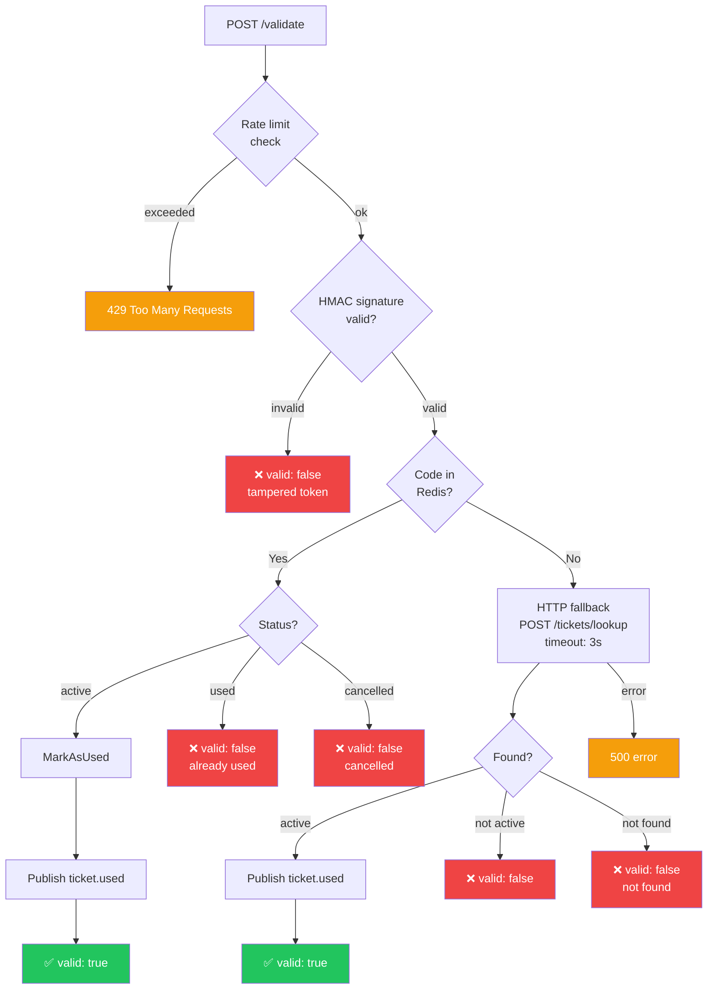
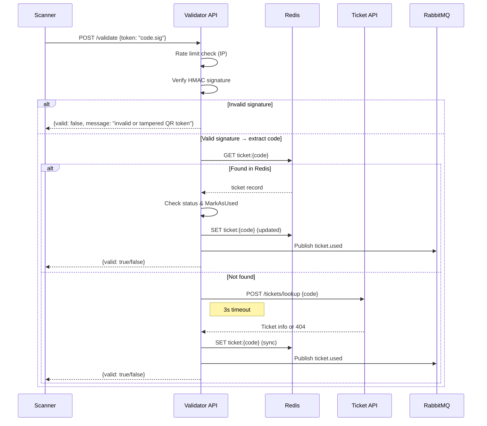

# Validator API Reference

**Base URL:** `http://localhost:8081`

The Validator API provides real-time ticket validation at venue entry points.

!!! info "Authentication"
    All endpoints require a valid AWS Cognito JWT in the `Authorization: Bearer <token>` header.
    Only callers in the **`admin`** Cognito group can validate tickets.
    A missing or invalid token returns `401`; a valid token without the `admin` group returns `403`.

!!! warning "Rate Limiting"
    The validation endpoint is protected by **IP-based rate limiting** (token bucket algorithm, 10 req/s with burst of 20). Clients exceeding the limit receive a `429 Too Many Requests` response with a `Retry-After` header.

!!! info "Bidirectional Reconciliation"
    On successful validation, the Validator publishes a `ticket.used` event to RabbitMQ. The Ticket Service consumes this event and marks the ticket as used in its own database, keeping both systems in sync.

---

## Endpoints Overview

| Method | Path | Description |
|---|---|---|
| `POST` | `/validate` | Validate a ticket by QR code |
| `GET` | `/metrics` | Prometheus metrics endpoint |

---

## POST /validate

Validate a ticket by its HMAC-signed token (scanned from QR). The handler first verifies the HMAC signature to extract the ticket code, then checks Redis (fast path), falling back to the Ticket Service via HTTP if not found locally.

### Request Body

```json
{
  "token": "a1b2c3d4-e5f6-7890-abcd-ef1234567890.hmac_signature_hex"
}
```

| Field | Type | Required | Description |
|---|---|---|---|
| `token` | `string` | Yes | HMAC-signed token from QR scan (`code.signature` format) |

### Response — 200 OK (Valid)

```json
{
  "valid": true,
  "message": "ticket validated successfully"
}
```

### Response — 200 OK (Invalid)

```json
{
  "valid": false,
  "message": "ticket already used"
}
```

Possible invalid messages:

| Message | Description |
|---|---|
| `invalid or tampered QR token` | HMAC signature verification failed |
| `ticket is used` | Ticket was already scanned |
| `ticket is cancelled` | Ticket was revoked |
| `ticket not found` | No ticket with this code exists |

### Errors

| Status | Reason |
|---|---|
| `400` | Missing or invalid body / empty token |
| `401` | Missing or invalid JWT |
| `403` | Caller is not in the `admin` group |
| `429` | Rate limit exceeded (Retry-After header included) |
| `500` | Internal server error (DB or fallback failure) |

---

## Validation Strategy



---

## Dual Validation Pattern

The Validator uses a **two-tier validation** approach for maximum availability:

### Tier 0: HMAC Token Verification

- The handler verifies the HMAC-SHA256 signature of the scanned QR token
- Rejects tampered or forged tokens before any storage lookup
- Zero-cost rejection of invalid tokens

### Tier 1: Redis (Fast Path)

- Ticket data is synced asynchronously via RabbitMQ into Redis
- Key format: `ticket:{code}` with JSON value (`eventID`, `status`, `usedAt`, `syncedAt`)
- Sub-millisecond O(1) lookups by ticket code
- Works even if the Ticket Service is down

### Tier 2: HTTP Fallback (Slow Path)

- Used when a ticket is not yet synced locally
- Makes a synchronous HTTP POST to the Ticket Service (`POST /tickets/lookup`)
- 3-second timeout to prevent blocking
- Handles the race condition between purchase and sync



---

## Metrics Emitted

| Metric | Labels | Description |
|---|---|---|
| `tickets_validated_total` | `result=valid` | Successful validations |
| `tickets_validated_total` | `result=invalid` | Failed validations |
| `http_requests_total` | `method, path, status` | All HTTP requests |
| `http_request_duration_seconds` | `method, path` | Request latency histogram |
