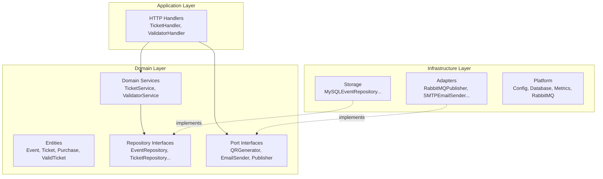
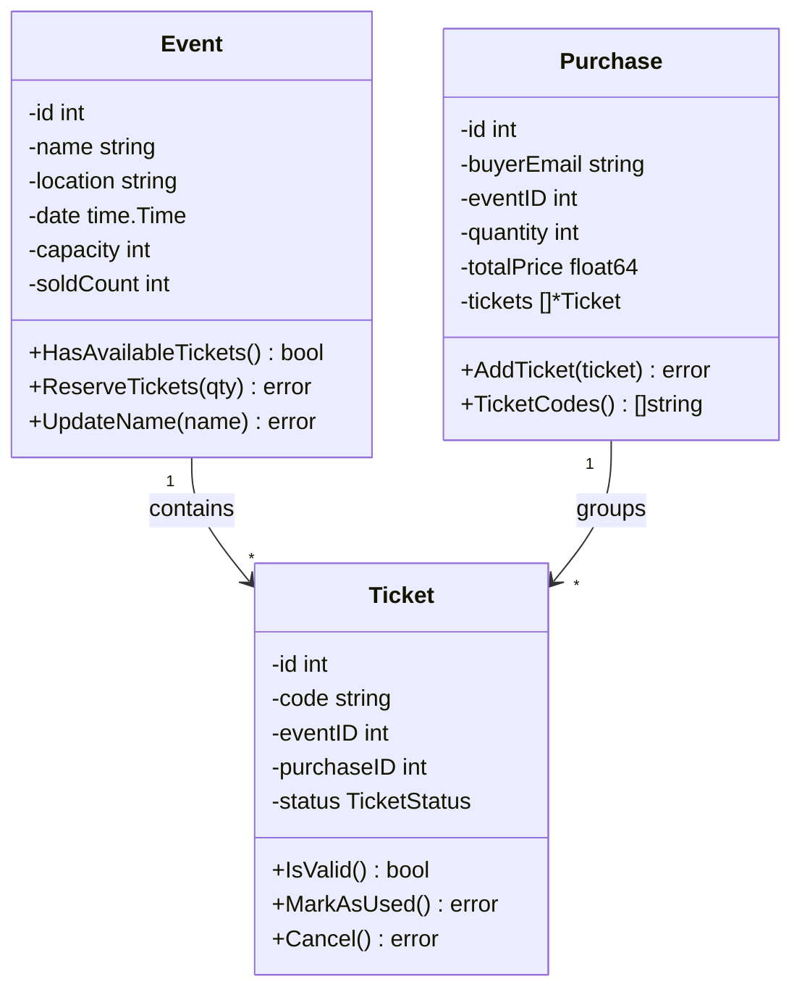
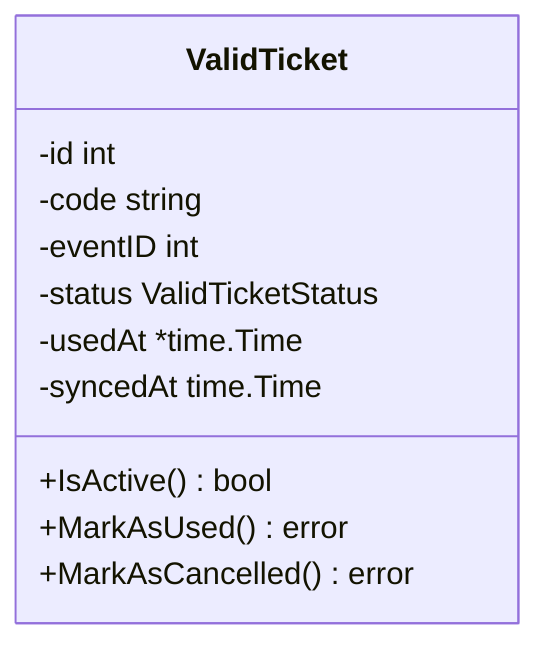

# Domain-Driven Design

EntradasQR aplica los patrones tácticos de DDD para garantizar que la lógica de negocio sea explícita, testeable y esté aislada de la infraestructura.

---

## Estructura en capas



---

## Reglas de diseño de entidades

Todas las entidades en EntradasQR siguen una encapsulación estricta:

### Patrón de campos privados + atributos

```go
type Ticket struct {
    id         int              // identity
    attributes ticketAttributes // all state
}

type ticketAttributes struct {
    code       string
    eventID    int
    purchaseID int
    status     TicketStatus
    usedAt     *time.Time
    createdAt  time.Time
    updatedAt  time.Time
}
```

### Reglas aplicadas

| Regla | Descripción |
|---|---|
| **Campos privados** | Todos los campos del struct son no exportados |
| **Validación en el constructor** | `NewTicket()` valida todos los invariantes antes de crear |
| **Métodos de acceso** | Getters de solo lectura para cada campo |
| **Mutación con validación** | `MarkAsUsed()`, `Cancel()` aplican reglas de negocio |
| **Sin estado inválido** | Una entidad nunca puede existir en un estado inválido |

---

## Lenguaje ubicuo

| Término | Significado |
|---|---|
| **Event** | Un evento programado con venue, fecha y capacidad de tickets |
| **Ticket** | Una unidad de admisión individual, identificada por un código UUID |
| **Purchase** | Una transacción que agrupa uno o más tickets para un comprador |
| **ValidTicket** | Una proyección optimizada para lectura de un ticket en la BD local del validador |
| **Emitted** | Un ticket que fue creado y está listo para usarse |
| **Used** | Un ticket que fue escaneado y validado en el venue |
| **Cancelled** | Un ticket que fue revocado y no puede usarse |

---

## Agregados

### Contexto de tickets



### Contexto del validador



---

## Contratos de repositorios

Los repositorios representan la **colección** de todas las entidades de un tipo dado. Definen garantías claras:

- `Get(id)` → devuelve `nil` si no se encuentra, `error` solo ante fallos de infraestructura
- `GetByCode(code)` → misma semántica que `Get`
- `Add(entity)` → persiste una nueva entidad y asigna el ID generado por la BD mediante `SetID()`
- `Update(entity)` → persiste los cambios en una entidad existente
- `FindByXYZ(criteria)` → devuelve un slice filtrado

Las implementaciones viven en el paquete `storage` y usan MySQL a través de `database/sql`.

### Identidad asignada por la base de datos

Las entidades se crean con un ID placeholder de `0` (por ejemplo, `NewEvent(0, ...)`). Después de `Add()`, el repositorio de MySQL recupera el ID autogenerado usando `LastInsertId()` y lo asigna a la entidad mediante `SetID()`. Esto asegura que quien llama reciba el ID real de la base de datos en la respuesta. Las tres entidades (`Event`, `Ticket`, `Purchase`) siguen este patrón.
