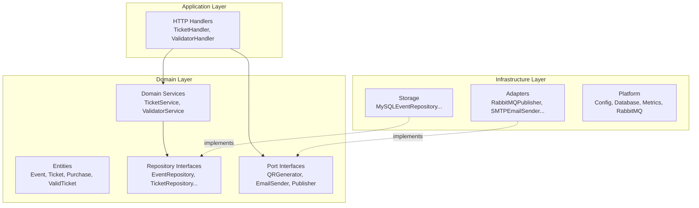
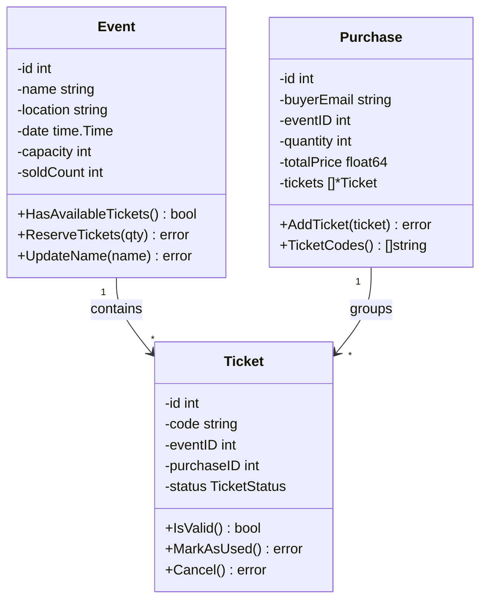
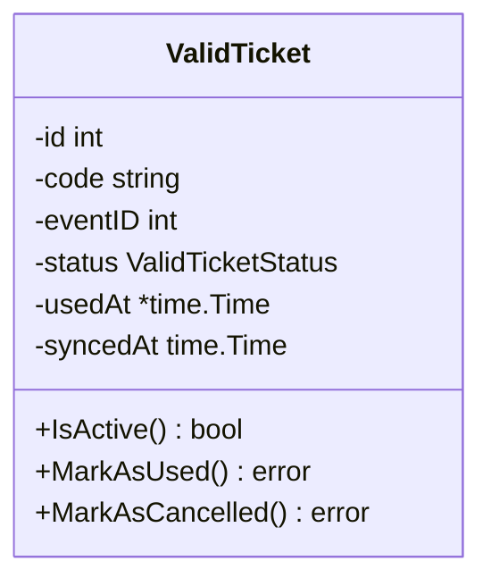

# Domain-Driven Design

EntradasQR applies DDD tactical patterns to ensure business logic is explicit, testable, and isolated from infrastructure.

---

## Layered Structure



---

## Entity Design Rules

All entities in EntradasQR follow strict encapsulation:

### Private Fields + Attributes Pattern

```go
type Ticket struct {
    id         int              // identity
    attributes ticketAttributes // all state
}

type ticketAttributes struct {
    code       string
    eventID    int
    purchaseID int
    status     TicketStatus
    usedAt     *time.Time
    createdAt  time.Time
    updatedAt  time.Time
}
```

### Rules Enforced

| Rule | Description |
|---|---|
| **Private fields** | All struct fields are unexported |
| **Constructor validation** | `NewTicket()` validates all invariants before creating |
| **Accessor methods** | Read-only getters for each field |
| **Mutation with validation** | `MarkAsUsed()`, `Cancel()` enforce business rules |
| **No invalid state** | An entity can never exist in an invalid state |

---

## Ubiquitous Language

| Term | Meaning |
|---|---|
| **Event** | A scheduled occasion with a venue, date, and ticket capacity |
| **Ticket** | A single admission unit, identified by a UUID code |
| **Purchase** | A transaction grouping one or more tickets for a buyer |
| **ValidTicket** | A read-optimized projection of a ticket in the validator's local DB |
| **Emitted** | A ticket that has been created and is ready for use |
| **Used** | A ticket that has been scanned and validated at a venue |
| **Cancelled** | A ticket that has been revoked and cannot be used |

---

## Aggregates

### Ticket Context



### Validator Context



---

## Repository Contracts

Repositories represent the **collection** of all entities of a given type. They define clear guarantees:

- `Get(id)` → returns `nil` for not-found, `error` only for infrastructure failures
- `GetByCode(code)` → same semantics as Get
- `Add(entity)` → persists a new entity and assigns the database-generated ID via `SetID()`
- `Update(entity)` → persists changes to an existing entity
- `FindByXYZ(criteria)` → returns a filtered slice

Implementations live in the `storage` package and use MySQL via `database/sql`.

### Database-Assigned Identity

Entities are created with a placeholder ID of `0` (e.g., `NewEvent(0, ...)`). After `Add()`, the MySQL repository retrieves the auto-generated ID using `LastInsertId()` and sets it on the entity via `SetID()`. This ensures the caller receives the real database ID in the response. All three entities (`Event`, `Ticket`, `Purchase`) follow this pattern.
