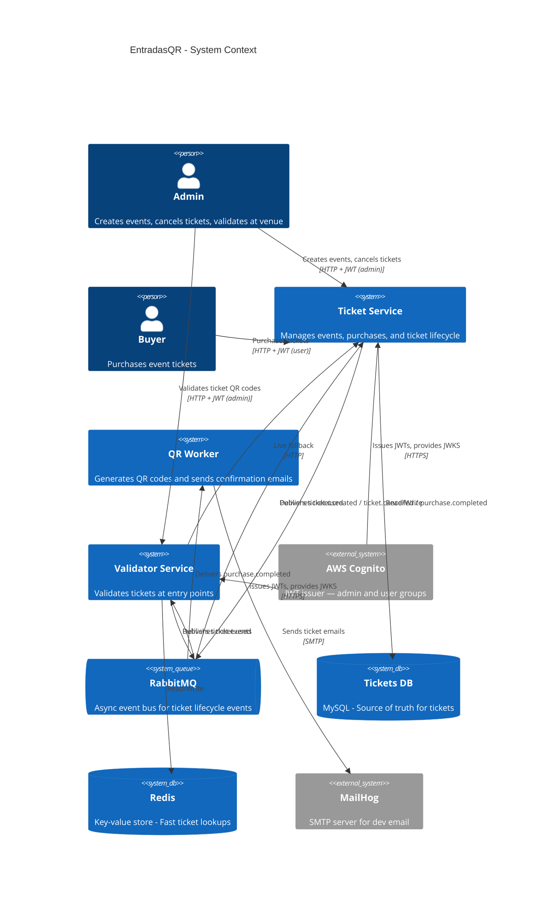
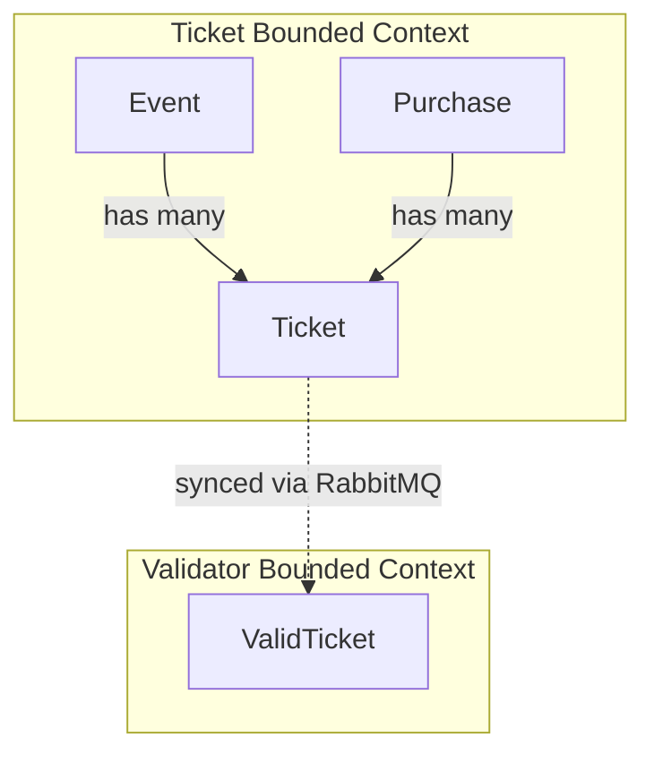
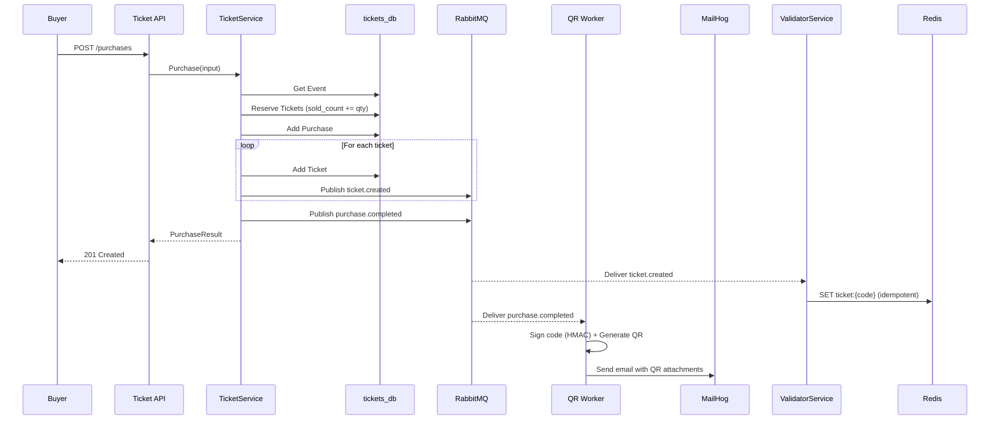
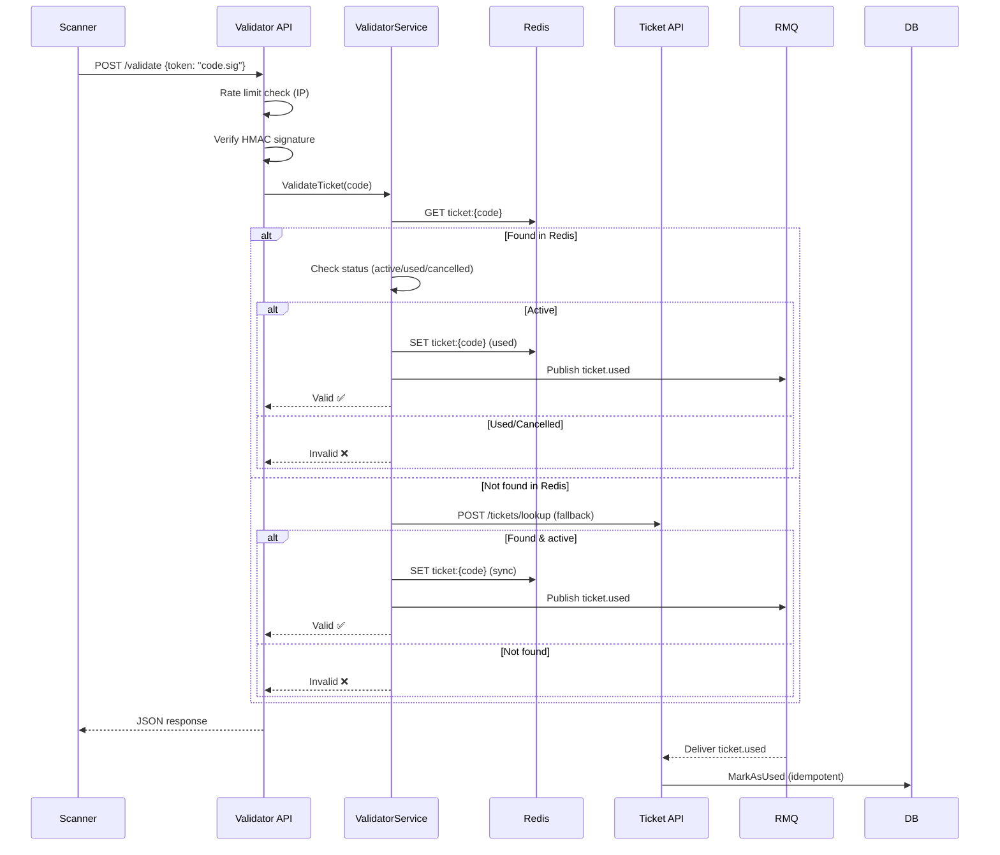

# Descripción general de la arquitectura

EntradasQR sigue una **arquitectura de microservicios** con dos contextos delimitados y tres servicios que se comunican mediante eventos asíncronos a través de RabbitMQ.

---

## Arquitectura de alto nivel

---

## Principios de diseño

### 1. Domain-Driven Design (DDD)
Cada servicio encapsula su propio contexto delimitado con entidades de dominio ricas, objetos de valor e interfaces de repositorio. Las reglas de negocio viven **exclusivamente** en la capa de dominio.

### 2. Ports & Adapters (Arquitectura Hexagonal)
El dominio define **puertos** (interfaces) para las dependencias externas. Las implementaciones concretas (**adaptadores**) se inyectan al inicio, manteniendo el dominio libre de preocupaciones de infraestructura.

### 3. Consistencia eventual
El Validator Service mantiene una **copia local** de los datos de tickets, sincronizada de forma asíncrona a través de RabbitMQ. Esto permite validaciones en sub-milisegundos en los puntos de entrada al evento sin depender de que el Ticket Service esté disponible.

### 4. Fallback en vivo
Cuando un ticket no se encuentra en la caché local (por ejemplo, por una condición de carrera durante la sincronización), el Validator recurre a una **llamada HTTP síncrona** al Ticket Service con un timeout de 3 segundos.

### 5. Consumidores idempotentes
Los consumidores de RabbitMQ están diseñados para manejar **reprocesamientos de mensajes** de forma segura. Crear un ticket ya existente o cancelar un ticket ya cancelado no produce ningún efecto.

### 6. Reconciliación bidireccional
Cuando el Validator Service marca un ticket como usado, publica un evento `ticket.used` de vuelta a RabbitMQ. El Ticket Service consume este evento y actualiza el estado del ticket en su propia base de datos, manteniendo ambos servicios sincronizados.

### 7. Rate limiting
La Validator API usa **rate limiting por IP** (algoritmo token bucket) para protegerse contra ataques de fuerza bruta que intenten adivinar UUIDs en el endpoint de validación.

---

## Límites de servicio

| Aspecto | Ticket Service | QR Worker | Validator Service |
|---|---|---|---|
| **Responsabilidad** | CRUD de eventos, compra y cancelación de tickets | Generación de QR y envío de emails | Validación de tickets en el venue |
| **Base de datos** | `tickets_db` MySQL (puerto 3306) | Ninguna | Redis (puerto 6379) |
| **Puerto HTTP** | 8080 | — (solo consumidor) | 8081 |
| **Entidades** | Event, Ticket, Purchase | — (usa eventos de dominio) | ValidTicket |
| **Rol** | Fuente de verdad | Procesador asíncrono | Réplica optimizada para lectura |

---

## Flujo de datos

### Flujo de compra

### Flujo de validación

