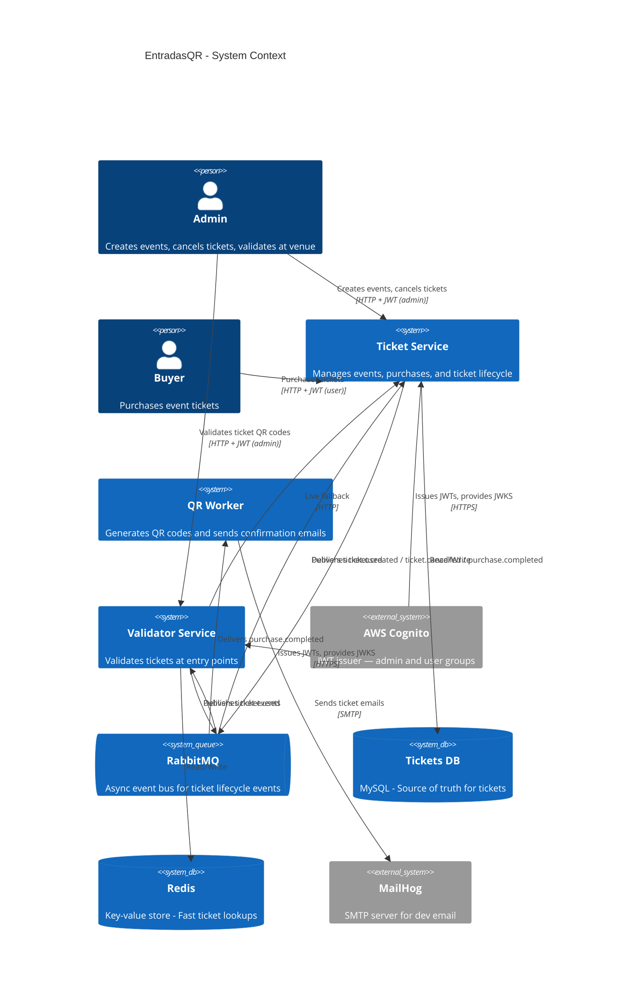
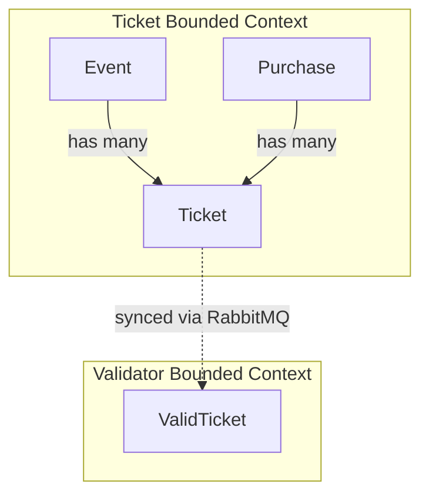
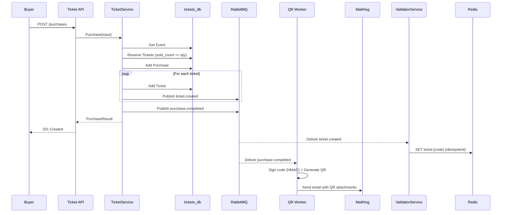
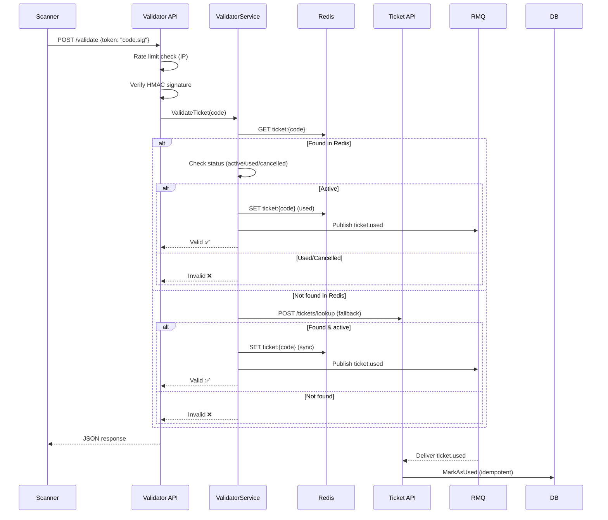

# Architecture Overview

EntradasQR follows a **microservices architecture** with two bounded contexts and three services communicating through asynchronous events via RabbitMQ.

---

## High-Level Architecture

---

## Design Principles

### 1. Domain-Driven Design (DDD)
Each service encapsulates its own bounded context with rich domain entities, value objects, and repository interfaces. Business rules live **exclusively** in the domain layer.

### 2. Ports & Adapters (Hexagonal Architecture)
The domain defines **ports** (interfaces) for external dependencies. Concrete implementations (**adapters**) are injected at startup, keeping the domain free of infrastructure concerns.

### 3. Eventual Consistency
The Validator Service maintains a **local copy** of ticket data, synced asynchronously via RabbitMQ. This allows sub-millisecond validation at venue entry points without depending on the Ticket Service being available.

### 4. Live Fallback
When a ticket is not found in the local cache (e.g., race condition during sync), the Validator falls back to a **synchronous HTTP call** to the Ticket Service with a 3-second timeout.

### 5. Idempotent Consumers
RabbitMQ consumers are designed to handle **message replays** safely. Creating an already-existing ticket or cancelling an already-cancelled ticket are no-ops.

### 6. Bidirectional Reconciliation
When the Validator Service marks a ticket as used, it publishes a `ticket.used` event back to RabbitMQ. The Ticket Service consumes this event and updates the ticket status in its own database, keeping both services in sync.

### 7. Rate Limiting
The Validator API uses **IP-based rate limiting** (token bucket algorithm) to protect against brute-force UUID guessing attacks on the validation endpoint.

---

## Service Boundaries

| Aspect | Ticket Service | QR Worker | Validator Service |
|---|---|---|---|
| **Responsibility** | Event CRUD, ticket purchase, cancellation | QR generation, email delivery | Ticket validation at venue |
| **Database** | `tickets_db` MySQL (port 3306) | None | Redis (port 6379) |
| **HTTP Port** | 8080 | — (consumer only) | 8081 |
| **Entities** | Event, Ticket, Purchase | — (uses domain events) | ValidTicket |
| **Role** | Source of truth | Async processor | Read-optimized replica |

---

## Data Flow

### Purchase Flow

### Validation Flow

