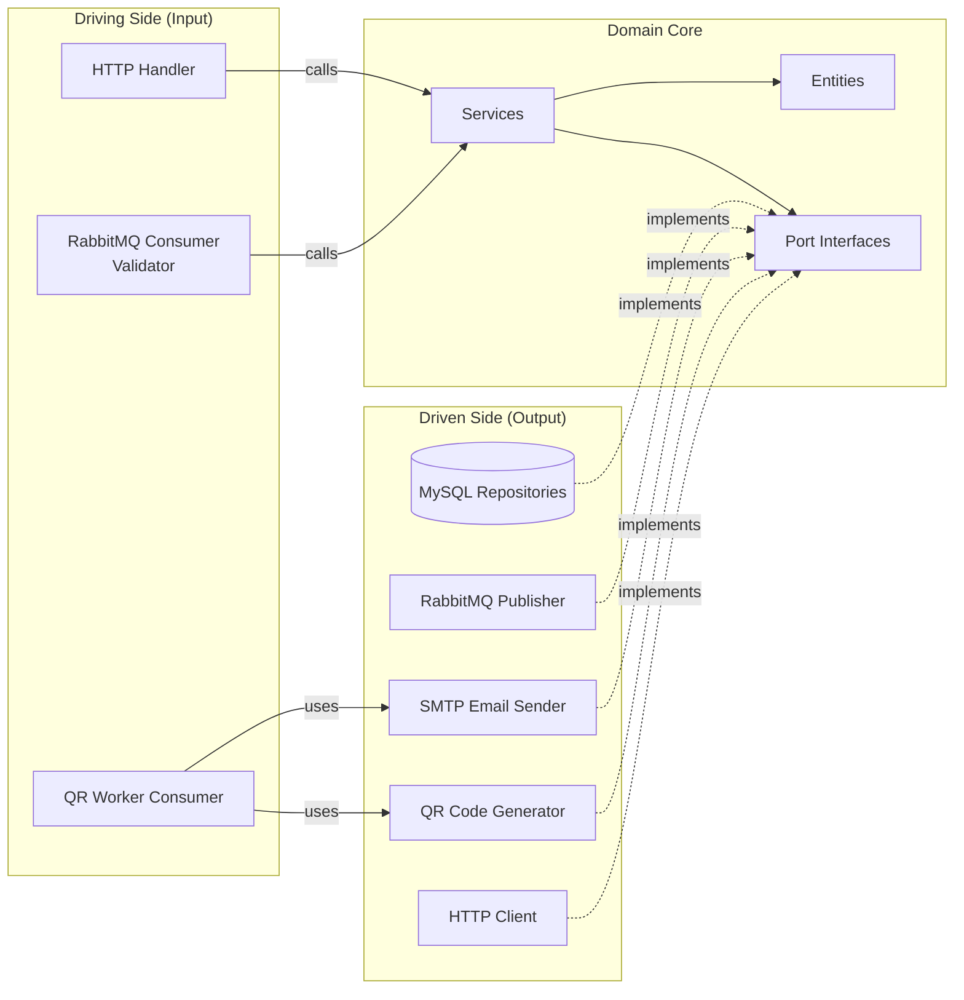

# Ports & Adapters

El patrón de Arquitectura Hexagonal (Ports & Adapters) garantiza que el núcleo del dominio tenga **cero dependencias** en la infraestructura. Toda comunicación externa fluye a través de interfaces bien definidas.

---

## Diagrama de arquitectura



---

## Puertos (interfaces)

Los puertos se definen **en el paquete de dominio** y expresan las capacidades que el dominio necesita.

### Puertos del contexto de tickets

| Puerto | Paquete | Propósito |
|---|---|---|
| `EventRepository` | `internal/ticket` | CRUD de eventos (Add asigna ID generado por la BD mediante SetID) |
| `TicketRepository` | `internal/ticket` | CRUD y consultas de tickets |
| `PurchaseRepository` | `internal/ticket` | CRUD de compras |
| `TicketEventPublisher` | `internal/ticket` | Publicar eventos de ciclo de vida al message broker |
| `QRGenerator` | `internal/ticket` | Generar imágenes de código QR |
| `EmailSender` | `internal/ticket` | Enviar emails con tickets |
| `IDGenerator` | `internal/ticket` | Generar IDs secuenciales |

### Puertos del contexto del validador

| Puerto | Paquete | Propósito |
|---|---|---|
| `ValidTicketRepository` | `internal/validator` | CRUD para la caché local de tickets |
| `TicketServiceClient` | `internal/validator` | Fallback en vivo al ticket service |
| `ValidatorEventPublisher` | `internal/validator` | Publicar eventos ticket.used para reconciliación |

---

## Adaptadores (implementaciones)

Los adaptadores viven **fuera del dominio** en los paquetes `storage/` o `adapter/`.

### Adaptadores de almacenamiento (controlados por nosotros)

| Adaptador | Implementa | Tecnología |
|---|---|---|
| `MySQLEventRepository` | `EventRepository` | MySQL via `database/sql` |
| `MySQLTicketRepository` | `TicketRepository` | MySQL via `database/sql` |
| `MySQLPurchaseRepository` | `PurchaseRepository` | MySQL via `database/sql` |
| `RedisValidTicketRepository` | `ValidTicketRepository` | Redis via go-redis/v9 |
| `MySQLIDGenerator` | `IDGenerator` | Tablas de secuencia en MySQL |
| `HMACTokenSigner` | `TokenSigner` | HMAC-SHA256 (crypto/hmac) |

### Adaptadores externos (no controlados por nosotros)

| Adaptador | Implementa | Tecnología |
|---|---|---|
| `RabbitMQPublisher` (ticket) | `TicketEventPublisher` | RabbitMQ (AMQP 0.9.1) |
| `RabbitMQPublisher` (validator) | `ValidatorEventPublisher` | RabbitMQ (AMQP 0.9.1) |
| `RabbitMQConsumer` | — (adaptador driving, Validator) | RabbitMQ (AMQP 0.9.1) |
| `QRWorkerConsumer` | — (adaptador driving, QR Worker) | RabbitMQ (AMQP 0.9.1) |
| `TicketUsedConsumer` | — (adaptador driving, Ticket API) | RabbitMQ (AMQP 0.9.1) |
| `QRCodeGenerator` | `QRGenerator` | librería go-qrcode |
| `SMTPEmailSender` | `EmailSender` | SMTP (MailHog en dev) |
| `TicketServiceHTTPClient` | `TicketServiceClient` | HTTP (net/http) |

---

## Regla de dependencias

```
Domain ← Application ← Infrastructure
```

- El **dominio** no sabe nada de HTTP, SQL ni RabbitMQ
- La **aplicación** (handlers) depende de interfaces del dominio
- La **infraestructura** (storage, adapters) implementa interfaces del dominio
- Las dependencias se **inyectan** en `cmd/*/main.go`

### Ejemplo de cableado (main.go)

```go
// --- Ticket API (cmd/ticket-api/main.go) ---

// Storage adapters
eventRepo := ticketstorage.NewMySQLEventRepository(db)
ticketRepo := ticketstorage.NewMySQLTicketRepository(db)
purchaseRepo := ticketstorage.NewMySQLPurchaseRepository(db)

// External adapters
publisher := ticketadapter.NewRabbitMQPublisher(rmqCh)

// Domain service (receives ports)
svc := ticket.NewTicketService(eventRepo, ticketRepo, purchaseRepo, publisher, idGen)

// Consumer (ticket.used reconciliation from Validator)
usedConsumer := ticketadapter.NewTicketUsedConsumer(rmqCh, svc, logger)
usedConsumer.StartConsuming(ctx)

// HTTP handler (receives service + event repo for queries + logger)
handler := tickethandler.NewTicketHandler(svc, eventRepo, logger)

// --- Validator API (cmd/validator-api/main.go) ---

// Adapters
ticketClient := validatoradapter.NewTicketServiceHTTPClient(cfg.TicketServiceURL)
eventPublisher := validatoradapter.NewRabbitMQPublisher(rmqCh)
rateLimiter := appmiddleware.NewIPRateLimiter(10, 20, logger)

// Domain service (receives ports including publisher for reconciliation)
svc := validator.NewValidatorService(validTicketRepo, ticketClient, eventPublisher, logger)

// --- QR Worker (cmd/qr-worker/main.go) ---

// External adapters
qrGen := ticketadapter.NewQRCodeGenerator(256)
emailSender := ticketadapter.NewSMTPEmailSender(host, port, from, logger)

// Driving adapter (consumes purchase.completed from RabbitMQ)
consumer := ticketadapter.NewQRWorkerConsumer(rmqCh, qrGen, emailSender, logger)
consumer.StartConsuming(ctx)
```
