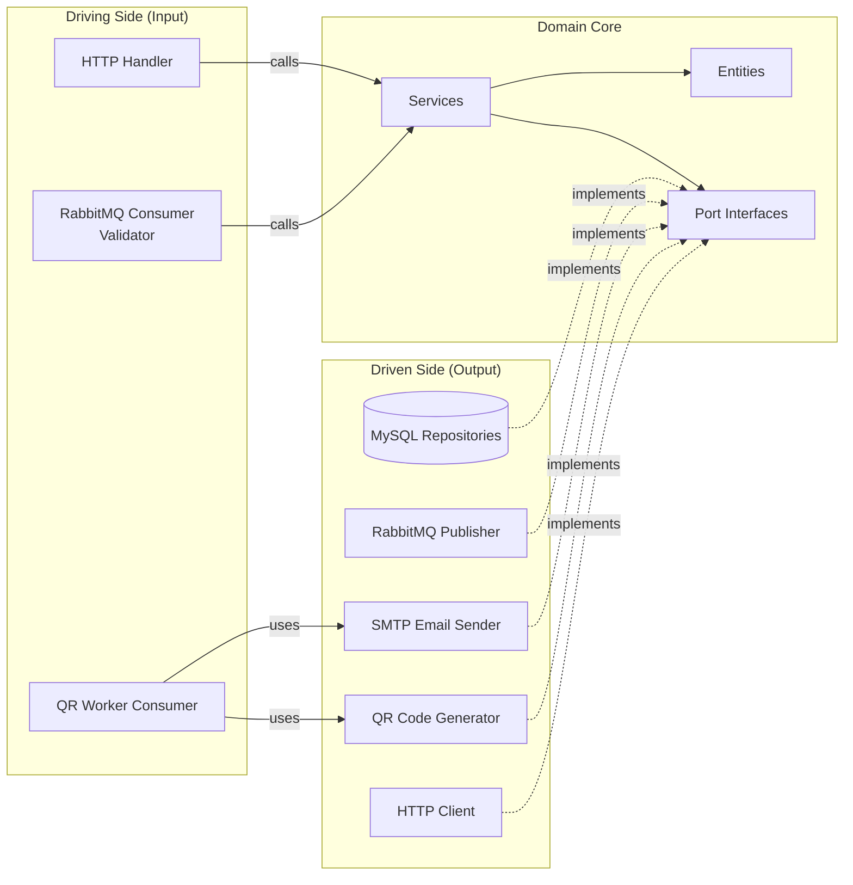

# Ports & Adapters

The Hexagonal Architecture (Ports & Adapters) pattern ensures the domain core has **zero dependencies** on infrastructure. All external communication flows through well-defined interfaces.

---

## Architecture Diagram



---

## Ports (Interfaces)

Ports are defined **in the domain package** and express capabilities the domain needs.

### Ticket Context Ports

| Port | Package | Purpose |
|---|---|---|
| `EventRepository` | `internal/ticket` | CRUD for events (Add sets DB-generated ID via SetID) |
| `TicketRepository` | `internal/ticket` | CRUD + queries for tickets |
| `PurchaseRepository` | `internal/ticket` | CRUD for purchases |
| `TicketEventPublisher` | `internal/ticket` | Publish lifecycle events to message broker |
| `QRGenerator` | `internal/ticket` | Generate QR code images |
| `EmailSender` | `internal/ticket` | Send ticket emails |
| `IDGenerator` | `internal/ticket` | Generate sequential IDs |

### Validator Context Ports

| Port | Package | Purpose |
|---|---|---|
| `ValidTicketRepository` | `internal/validator` | CRUD for local ticket cache |
| `TicketServiceClient` | `internal/validator` | Live fallback to ticket service |
| `ValidatorEventPublisher` | `internal/validator` | Publish ticket.used events for reconciliation |

---

## Adapters (Implementations)

Adapters live **outside the domain** in `storage/` or `adapter/` packages.

### Storage Adapters (We Control)

| Adapter | Implements | Technology |
|---|---|---|
| `MySQLEventRepository` | `EventRepository` | MySQL via `database/sql` |
| `MySQLTicketRepository` | `TicketRepository` | MySQL via `database/sql` |
| `MySQLPurchaseRepository` | `PurchaseRepository` | MySQL via `database/sql` |
| `RedisValidTicketRepository` | `ValidTicketRepository` | Redis via go-redis/v9 |
| `MySQLIDGenerator` | `IDGenerator` | MySQL sequence tables |
| `HMACTokenSigner` | `TokenSigner` | HMAC-SHA256 (crypto/hmac) |

### External Adapters (We Don't Control)

| Adapter | Implements | Technology |
|---|---|---|
| `RabbitMQPublisher` (ticket) | `TicketEventPublisher` | RabbitMQ (AMQP 0.9.1) |
| `RabbitMQPublisher` (validator) | `ValidatorEventPublisher` | RabbitMQ (AMQP 0.9.1) |
| `RabbitMQConsumer` | — (driving adapter, Validator) | RabbitMQ (AMQP 0.9.1) |
| `QRWorkerConsumer` | — (driving adapter, QR Worker) | RabbitMQ (AMQP 0.9.1) |
| `TicketUsedConsumer` | — (driving adapter, Ticket API) | RabbitMQ (AMQP 0.9.1) |
| `QRCodeGenerator` | `QRGenerator` | go-qrcode library |
| `SMTPEmailSender` | `EmailSender` | SMTP (MailHog in dev) |
| `TicketServiceHTTPClient` | `TicketServiceClient` | HTTP (net/http) |

---

## Dependency Rule

```
Domain ← Application ← Infrastructure
```

- **Domain** knows nothing about HTTP, SQL, or RabbitMQ
- **Application** (handlers) depends on domain interfaces
- **Infrastructure** (storage, adapters) implements domain interfaces
- Dependencies are **injected** in `cmd/*/main.go`

### Wiring Example (main.go)

```go
// --- Ticket API (cmd/ticket-api/main.go) ---

// Storage adapters
eventRepo := ticketstorage.NewMySQLEventRepository(db)
ticketRepo := ticketstorage.NewMySQLTicketRepository(db)
purchaseRepo := ticketstorage.NewMySQLPurchaseRepository(db)

// External adapters
publisher := ticketadapter.NewRabbitMQPublisher(rmqCh)

// Domain service (receives ports)
svc := ticket.NewTicketService(eventRepo, ticketRepo, purchaseRepo, publisher, idGen)

// Consumer (ticket.used reconciliation from Validator)
usedConsumer := ticketadapter.NewTicketUsedConsumer(rmqCh, svc, logger)
usedConsumer.StartConsuming(ctx)

// HTTP handler (receives service + event repo for queries + logger)
handler := tickethandler.NewTicketHandler(svc, eventRepo, logger)

// --- Validator API (cmd/validator-api/main.go) ---

// Adapters
ticketClient := validatoradapter.NewTicketServiceHTTPClient(cfg.TicketServiceURL)
eventPublisher := validatoradapter.NewRabbitMQPublisher(rmqCh)
rateLimiter := appmiddleware.NewIPRateLimiter(10, 20, logger)

// Domain service (receives ports including publisher for reconciliation)
svc := validator.NewValidatorService(validTicketRepo, ticketClient, eventPublisher, logger)

// --- QR Worker (cmd/qr-worker/main.go) ---

// External adapters
qrGen := ticketadapter.NewQRCodeGenerator(256)
emailSender := ticketadapter.NewSMTPEmailSender(host, port, from, logger)

// Driving adapter (consumes purchase.completed from RabbitMQ)
consumer := ticketadapter.NewQRWorkerConsumer(rmqCh, qrGen, emailSender, logger)
consumer.StartConsuming(ctx)
```
