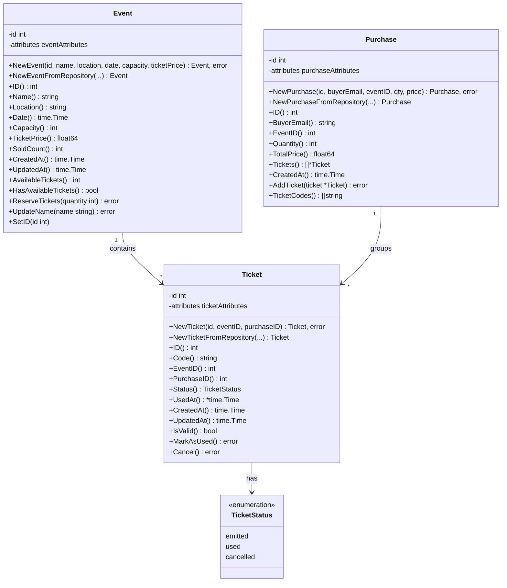
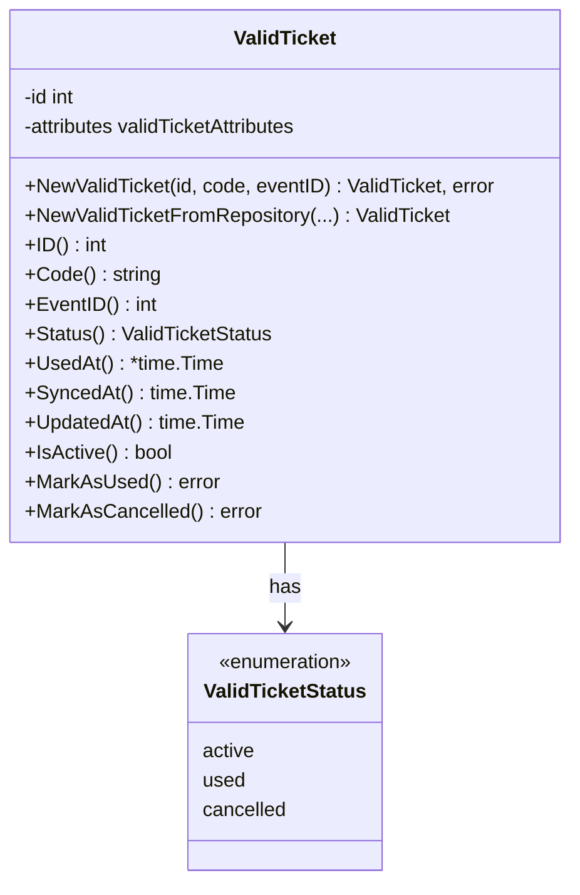
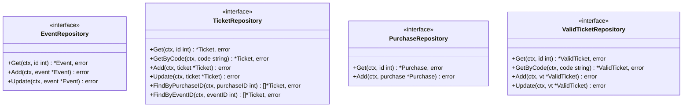
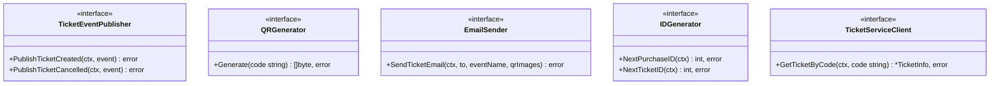
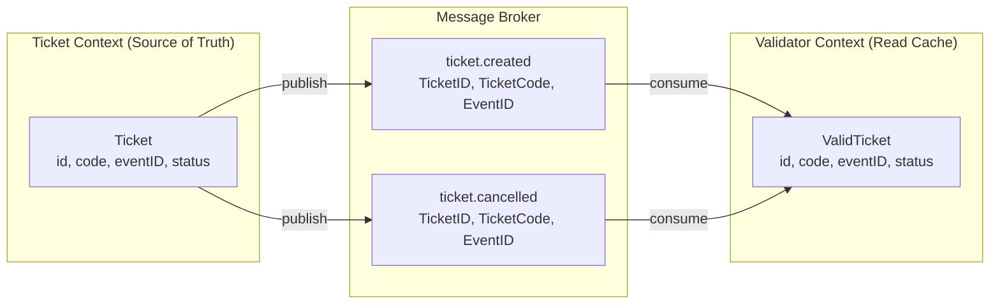

# Entity Diagrams

Complete class diagrams for all domain entities across both bounded contexts.

---

## Ticket Context — Full Class Diagram

---

## Validator Context — Full Class Diagram

---

## Repository Interfaces

---

## Service Interfaces

---

## Cross-Context Relationship

