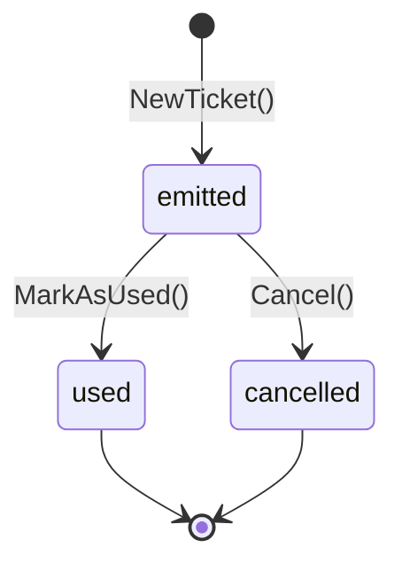
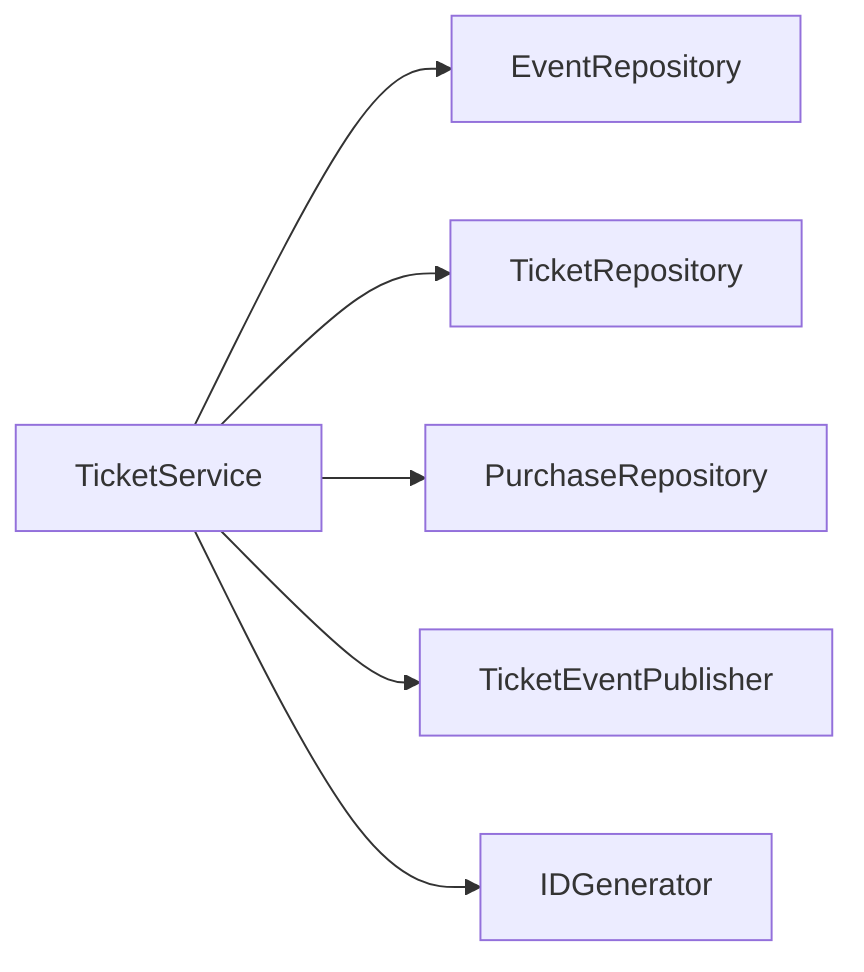

# Contexto acotado: Tickets

El contexto de Tickets es la **fuente de verdad** para eventos, compras y tickets. Gestiona el ciclo de vida completo del ticket desde su creación hasta su cancelación.

---

## Entidades

### Event

Un evento representa una ocasión programada con un lugar y capacidad limitada de tickets.

| Campo | Tipo | Descripción |
|---|---|---|
| `id` | `int` | Identificador único |
| `name` | `string` | Nombre del evento |
| `location` | `string` | Lugar del evento |
| `date` | `time.Time` | Fecha y hora del evento |
| `capacity` | `int` | Número máximo de tickets |
| `ticketPrice` | `float64` | Precio por ticket |
| `soldCount` | `int` | Número de tickets vendidos hasta el momento |
| `createdAt` | `time.Time` | Timestamp de creación |
| `updatedAt` | `time.Time` | Timestamp de última actualización |

**Reglas de negocio:**

- La capacidad debe ser positiva
- El precio del ticket debe ser positivo
- `soldCount` no puede superar `capacity`
- `ReserveTickets(qty)` incrementa `soldCount` de forma atómica
- `HasAvailableTickets()` verifica que `capacity - soldCount > 0`

**Asignación de identidad:**

El campo `id` es asignado por la base de datos (`AUTO_INCREMENT`). La entidad se crea con un ID placeholder y, después de `EventRepository.Add()`, el repositorio asigna el ID real generado por la base de datos mediante `SetID()`. El mismo patrón aplica a las entidades `Ticket` y `Purchase`.

---

### Ticket

Un ticket es una unidad de admisión identificada por un código UUID. Sigue una máquina de estados.

| Campo | Tipo | Descripción |
|---|---|---|
| `id` | `int` | Identificador único |
| `code` | `string` | Código UUID (usado para el QR) |
| `eventID` | `int` | Evento asociado |
| `purchaseID` | `int` | Compra asociada |
| `status` | `TicketStatus` | Estado actual en el ciclo de vida |
| `usedAt` | `*time.Time` | Momento en que fue escaneado |
| `createdAt` | `time.Time` | Timestamp de creación |
| `updatedAt` | `time.Time` | Timestamp de última actualización |

**Máquina de estados:**

| Estado | Descripción |
|---|---|
| `emitted` | Ticket creado y listo para usar |
| `used` | Ticket escaneado en el lugar del evento |
| `cancelled` | Ticket revocado |

**Reglas de negocio:**

- Solo los tickets `emitted` pueden marcarse como `used`
- Solo los tickets `emitted` pueden ser `cancelled`
- `MarkAsUsed()` establece `usedAt` con la hora actual
- `IsValid()` retorna `true` únicamente para el estado `emitted`

---

### Purchase

Una compra agrupa uno o más tickets para un comprador.

| Campo | Tipo | Descripción |
|---|---|---|
| `id` | `int` | Identificador único |
| `buyerEmail` | `string` | Email del comprador |
| `eventID` | `int` | Evento asociado |
| `quantity` | `int` | Cantidad de tickets |
| `totalPrice` | `float64` | Precio total pagado |
| `tickets` | `[]*Ticket` | Tickets asociados |
| `createdAt` | `time.Time` | Timestamp de creación |

**Reglas de negocio:**

- No se pueden agregar más tickets que la cantidad declarada
- `TicketCodes()` retorna todos los códigos UUID para la generación de QR

---

## Servicio de dominio: TicketService

El `TicketService` orquesta los flujos de compra y cancelación.

### Dependencias (Puertos)

### Flujo de compra

1. Cargar el evento y verificar disponibilidad
2. Reservar tickets (actualización atómica de `soldCount`)
3. Calcular `totalPrice` en el servidor: `event.TicketPrice() × quantity`
4. Crear la entidad `Purchase` con el total calculado
5. Crear las entidades `Ticket` (una por unidad)
6. Persistir compra y tickets
7. Publicar evento `ticket.created` por cada ticket
8. Retornar `PurchaseResult` con tickets e información del evento

### Flujo de cancelación

1. Cargar ticket por código
2. Llamar a `ticket.Cancel()` (valida el estado)
3. Persistir el ticket actualizado
4. Publicar evento `ticket.cancelled`

### GetTicketByCode

1. Cargar ticket del repositorio por código UUID
2. Retornar el ticket o error de no encontrado

---

## Eventos publicados

| Evento | Routing Key | Payload |
|---|---|---|
| `TicketCreatedEvent` | `ticket.created` | `{ TicketID, TicketCode, EventID }` |
| `TicketCancelledEvent` | `ticket.cancelled` | `{ TicketID, TicketCode, EventID }` |
