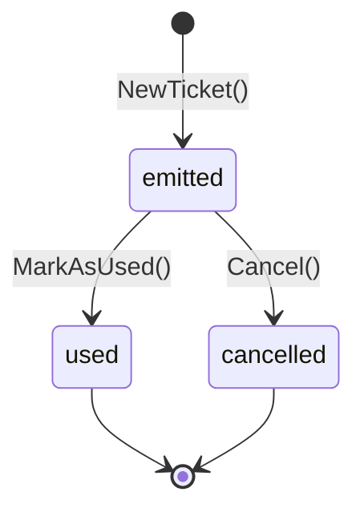
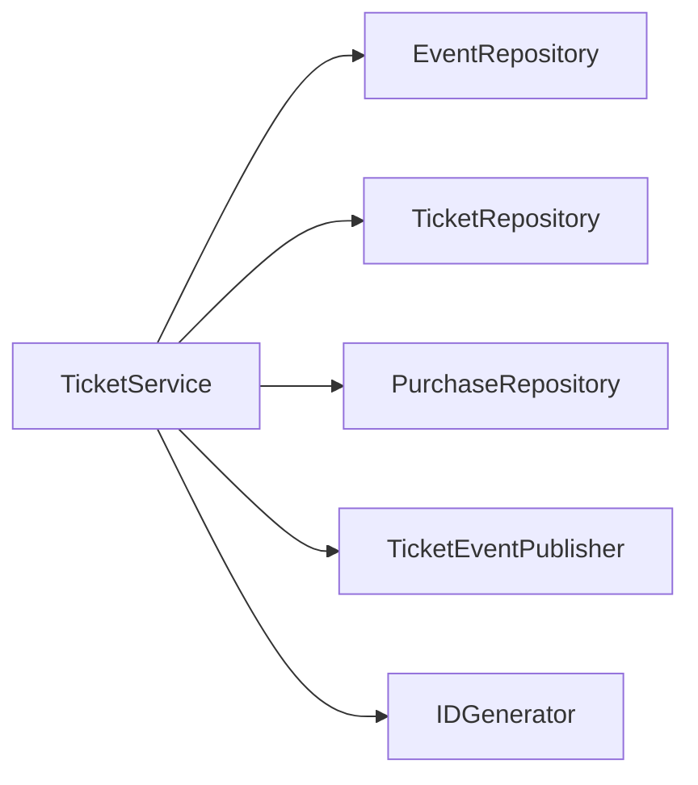

# Ticket Bounded Context

The Ticket context is the **source of truth** for events, purchases, and tickets. It handles the full ticket lifecycle from creation through cancellation.

---

## Entities

### Event

An event represents a scheduled occasion with a venue and limited ticket capacity.

| Field | Type | Description |
|---|---|---|
| `id` | `int` | Unique identifier |
| `name` | `string` | Event name |
| `location` | `string` | Venue location |
| `date` | `time.Time` | Event date and time |
| `capacity` | `int` | Maximum number of tickets |
| `ticketPrice` | `float64` | Price per ticket |
| `soldCount` | `int` | Number of tickets sold so far |
| `createdAt` | `time.Time` | Creation timestamp |
| `updatedAt` | `time.Time` | Last update timestamp |

**Business Rules:**

- Capacity must be positive
- Ticket price must be positive
- `soldCount` cannot exceed `capacity`
- `ReserveTickets(qty)` atomically increments `soldCount`
- `HasAvailableTickets()` checks `capacity - soldCount > 0`

**Identity Assignment:**

The `id` field is assigned by the database (`AUTO_INCREMENT`). The entity is created with a placeholder ID, and after `EventRepository.Add()` the repository sets the real database-generated ID via `SetID()`. This same pattern is used by `Ticket` and `Purchase` entities.

---

### Ticket

A ticket is a single admission unit identified by a UUID code. It follows a state machine.

| Field | Type | Description |
|---|---|---|
| `id` | `int` | Unique identifier |
| `code` | `string` | UUID code (used for QR) |
| `eventID` | `int` | Associated event |
| `purchaseID` | `int` | Associated purchase |
| `status` | `TicketStatus` | Current lifecycle state |
| `usedAt` | `*time.Time` | When the ticket was scanned |
| `createdAt` | `time.Time` | Creation timestamp |
| `updatedAt` | `time.Time` | Last update timestamp |

**State Machine:**

| Status | Description |
|---|---|
| `emitted` | Ticket created and ready for use |
| `used` | Ticket has been scanned at the venue |
| `cancelled` | Ticket has been revoked |

**Business Rules:**

- Only `emitted` tickets can be marked as `used`
- Only `emitted` tickets can be `cancelled`
- `MarkAsUsed()` sets `usedAt` to current time
- `IsValid()` returns true only for `emitted` status

---

### Purchase

A purchase groups one or more tickets for a buyer.

| Field | Type | Description |
|---|---|---|
| `id` | `int` | Unique identifier |
| `buyerEmail` | `string` | Buyer's email address |
| `eventID` | `int` | Associated event |
| `quantity` | `int` | Number of tickets |
| `totalPrice` | `float64` | Total price paid |
| `tickets` | `[]*Ticket` | Associated tickets |
| `createdAt` | `time.Time` | Creation timestamp |

**Business Rules:**

- Cannot add more tickets than the declared quantity
- `TicketCodes()` returns all UUID codes for QR generation

---

## Domain Service: TicketService

The `TicketService` orchestrates the purchase and cancellation flows.

### Dependencies (Ports)

### Purchase Flow

1. Load the event and check availability
2. Reserve tickets (atomic `soldCount` update)
3. Calculate `totalPrice` server-side: `event.TicketPrice() × quantity`
4. Create `Purchase` entity with calculated total
5. Create `Ticket` entities (one per quantity)
6. Persist purchase and tickets
7. Publish `ticket.created` event per ticket
8. Return `PurchaseResult` with tickets and event info

### Cancel Flow

1. Load ticket by code
2. Call `ticket.Cancel()` (validates state)
3. Persist updated ticket
4. Publish `ticket.cancelled` event

### GetTicketByCode

1. Load ticket from repository by UUID code
2. Return ticket or not-found error

---

## Events Published

| Event | Routing Key | Payload |
|---|---|---|
| `TicketCreatedEvent` | `ticket.created` | `{ TicketID, TicketCode, EventID }` |
| `TicketCancelledEvent` | `ticket.cancelled` | `{ TicketID, TicketCode, EventID }` |
