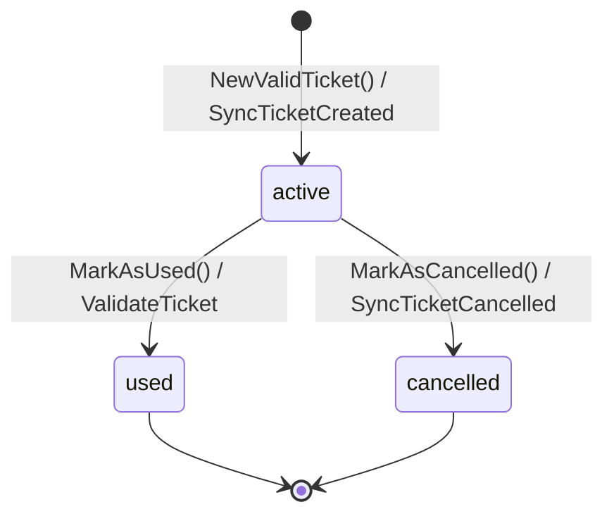
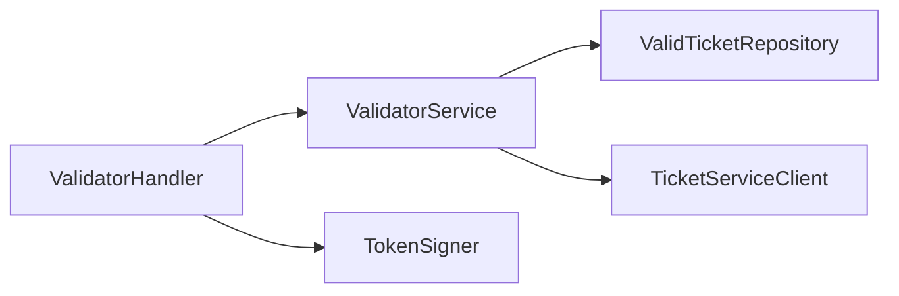
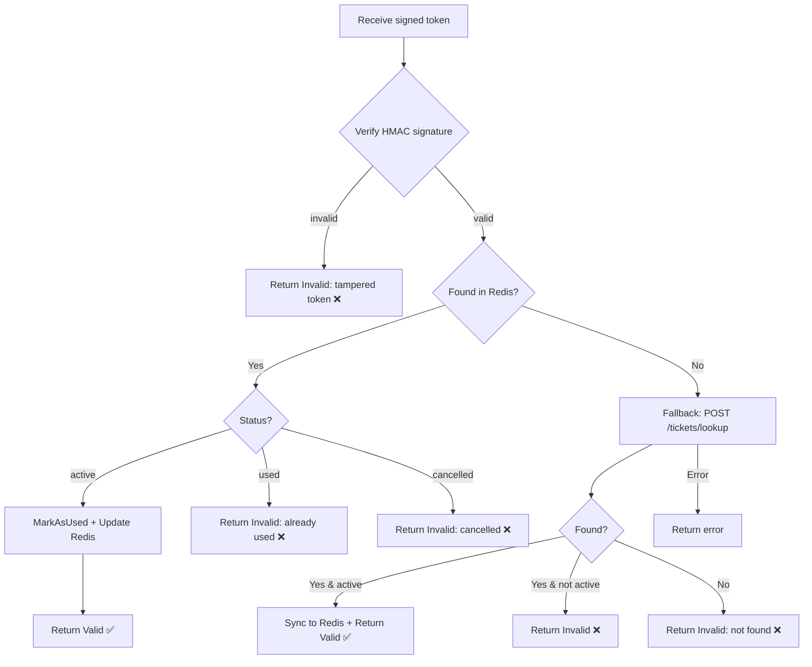
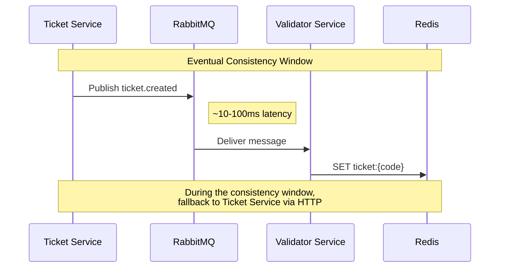

# Contexto acotado: Validación

El contexto de Validación mantiene una **copia local optimizada para lectura** de los datos de tickets en Redis para una validación rápida en los puntos de entrada al evento. Verifica tokens QR firmados con HMAC, recibe actualizaciones de forma asíncrona vía RabbitMQ y recurre al Ticket Service como fallback cuando los datos aún no están sincronizados.

---

## Entidad: ValidTicket

Un `ValidTicket` es una proyección de un ticket optimizada para el caso de uso de validación.

| Campo | Tipo | Descripción |
|---|---|---|
| `id` | `int` | Identificador único (local) |
| `code` | `string` | Código UUID que coincide con el ticket original |
| `eventID` | `int` | Evento asociado |
| `status` | `ValidTicketStatus` | Estado actual en el ciclo de vida |
| `usedAt` | `*time.Time` | Momento en que fue validado |
| `syncedAt` | `time.Time` | Momento en que fue sincronizado desde RabbitMQ |
| `updatedAt` | `time.Time` | Timestamp de última actualización |

**Máquina de estados:**

| Estado | Descripción |
|---|---|
| `active` | Ticket válido y disponible para usar en el evento |
| `used` | Ticket escaneado y validado |
| `cancelled` | Ticket revocado por el Ticket Service |

---

## Servicio de dominio: ValidatorService

El `ValidatorService` gestiona la validación de tickets y la sincronización de eventos.

### Dependencias (Puertos)

### Flujo de ValidateTicket

!!! info "Timeout del fallback"
    El fallback HTTP usa un **timeout de 3 segundos** para no bloquear el flujo de validación. Si el Ticket Service no está disponible, el escáner recibe un error en lugar de quedar colgado indefinidamente.

### SyncTicketCreated

1. Verificar si el ticket ya existe por código (idempotencia)
2. Si existe → no-op (seguro ante repetición de mensajes)
3. Si no existe → crear `ValidTicket` con estado `active`

### SyncTicketCancelled

1. Cargar ticket por código
2. Si no se encuentra → no-op (mensaje fuera de orden)
3. Si se encuentra → llamar a `MarkAsCancelled()` y persistir

---

## Modelo de consistencia

| Escenario | Comportamiento |
|---|---|
| Sincronización normal | Ticket disponible en Redis en ~100ms |
| Retraso en sincronización | Llamada HTTP de fallback al Ticket Service |
| Ticket Service caído | Se retorna error al escáner |
| Mensaje duplicado | Idempotente: no genera registros duplicados |
| Cancelación fuera de orden | No-op si el ticket aún no fue sincronizado |
