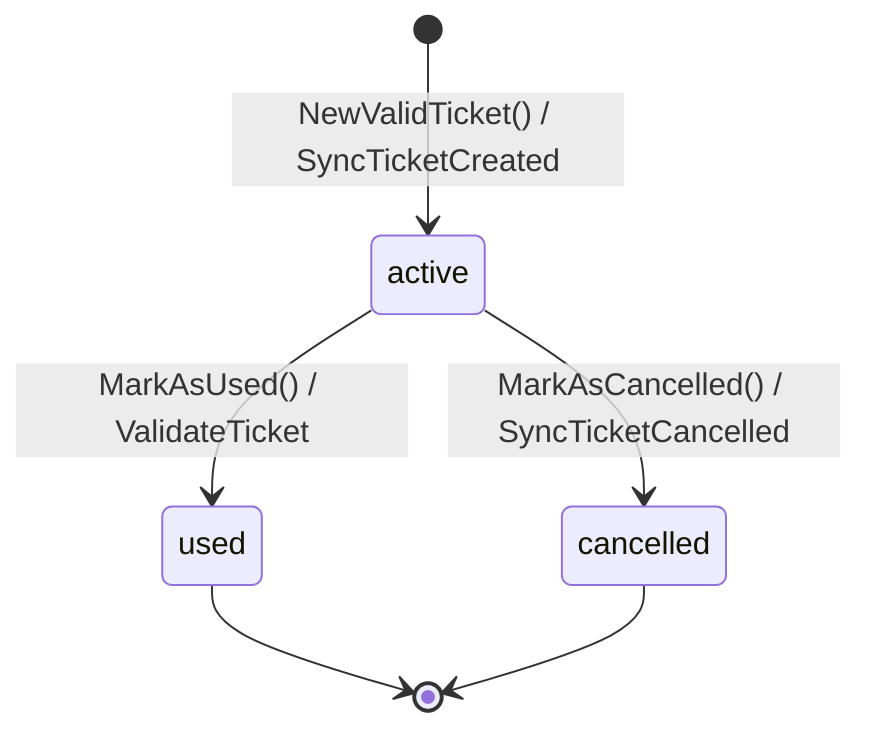
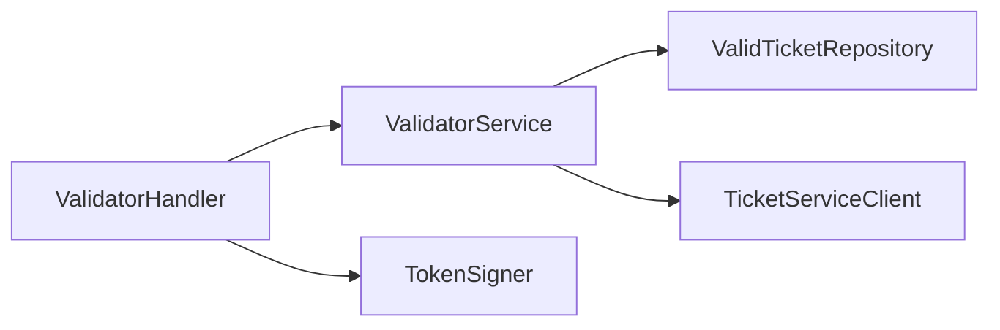
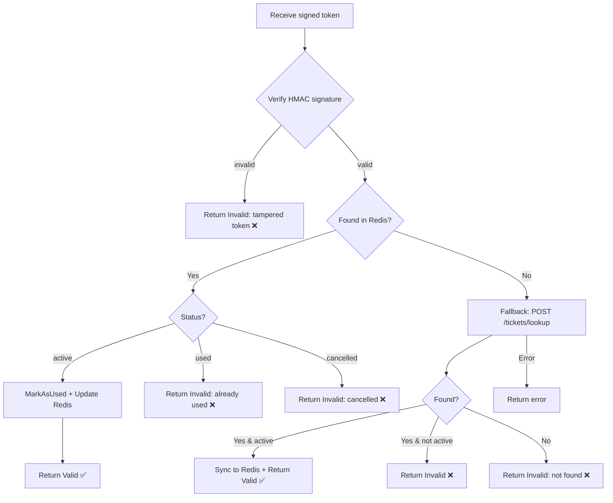
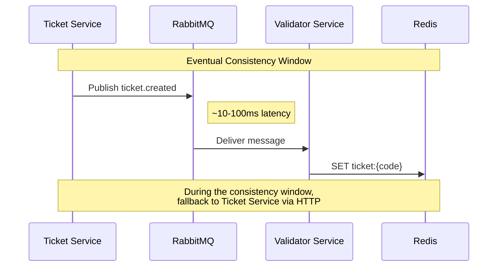

# Validator Bounded Context

The Validator context maintains a **read-optimized local copy** of ticket data in Redis for fast validation at venue entry points. It verifies HMAC-signed QR tokens, receives updates asynchronously via RabbitMQ, and falls back to the Ticket Service when data is not yet synced.

---

## Entity: ValidTicket

A `ValidTicket` is a projection of a ticket optimized for the validation use case.

| Field | Type | Description |
|---|---|---|
| `id` | `int` | Unique identifier (local) |
| `code` | `string` | UUID code matching the original ticket |
| `eventID` | `int` | Associated event |
| `status` | `ValidTicketStatus` | Current lifecycle state |
| `usedAt` | `*time.Time` | When the ticket was validated |
| `syncedAt` | `time.Time` | When the ticket was synced from RabbitMQ |
| `updatedAt` | `time.Time` | Last update timestamp |

**State Machine:**

| Status | Description |
|---|---|
| `active` | Ticket is valid and can be used at the venue |
| `used` | Ticket has been scanned and validated |
| `cancelled` | Ticket has been revoked by the Ticket Service |

---

## Domain Service: ValidatorService

The `ValidatorService` handles ticket validation and event synchronization.

### Dependencies (Ports)

### ValidateTicket Flow

!!! info "Fallback Timeout"
    The HTTP fallback uses a **3-second timeout** to avoid blocking the validation flow. If the Ticket Service is down, the scanner will receive an error rather than hanging indefinitely.

### SyncTicketCreated

1. Check if ticket already exists by code (idempotency)
2. If exists → no-op (message replay safe)
3. If not exists → create `ValidTicket` with `active` status

### SyncTicketCancelled

1. Load ticket by code
2. If not found → no-op (out-of-order message)
3. If found → call `MarkAsCancelled()` and persist

---

## Consistency Model

| Scenario | Behavior |
|---|---|
| Normal sync | Ticket available in Redis within ~100ms |
| Sync delay | Fallback HTTP call to Ticket Service |
| Ticket Service down | Error returned to scanner |
| Duplicate message | Idempotent: no duplicate records |
| Out-of-order cancel | No-op if ticket not yet synced |
