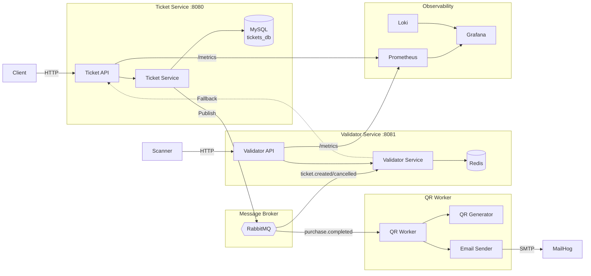

# EntradasQR

**Una plataforma moderna de venta de entradas para eventos, construida con Go y siguiendo principios de Domain-Driven Design.**

EntradasQR es un sistema basado en microservicios para la gestión de entradas con generación de códigos QR, envío de emails y validación en tiempo real. Demuestra patrones de arquitectura limpia como Ports & Adapters, consistencia eventual mediante colas de mensajes y observabilidad completa.

---

## Funcionalidades principales

| Funcionalidad | Descripción |
|---|---|
| **Gestión de eventos** | Crear eventos con control de capacidad y seguimiento automático de ventas |
| **Compra de entradas** | Comprar múltiples entradas con generación de QR y envío por email |
| **Validación QR** | Validación de entradas en tiempo real con caché local + fallback en vivo |
| **Sincronización Pub/Sub** | Consistencia eventual entre servicios a través de RabbitMQ |
| **Observabilidad** | Métricas Prometheus, logs con Loki, dashboards en Grafana |
| **Consumidores idempotentes** | Reenvío seguro de mensajes sin corrupción de datos |

---

## Visión general del sistema

---

## Enlaces rápidos

- [Visión general de la arquitectura](architecture/overview.md) — Cómo está diseñado el sistema
- [Primeros pasos](development/getting-started.md) — Levantar el proyecto localmente en minutos
- [Referencia de la API](api/ticket-api.md) — Documentación completa de los endpoints HTTP
- [Estrategia de testing](development/testing.md) — Tests unitarios, mocks y cobertura

---

## Stack tecnológico

| Capa | Tecnología |
|---|---|
| **Lenguaje** | Go 1.22+ |
| **Router HTTP** | chi |
| **Base de datos** | MySQL 8.0 |
| **Broker de mensajes** | RabbitMQ 3 |
| **Generación QR** | go-qrcode |
| **Email** | SMTP (MailHog para desarrollo) |
| **Métricas** | Prometheus + promhttp |
| **Logs** | slog (JSON) → Loki |
| **Dashboards** | Grafana |
| **Linting** | golangci-lint v2 |
| **Testing** | go test + sqlmock |
