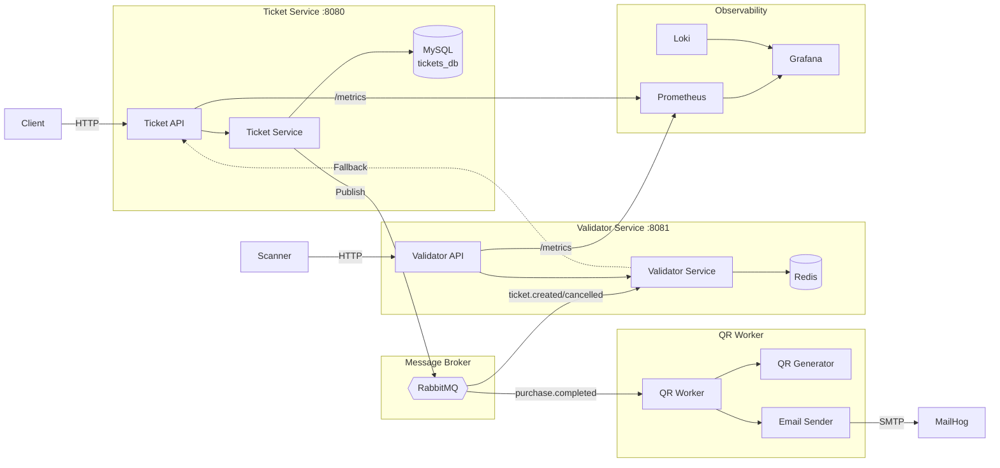

# EntradasQR

**A modern event ticketing platform built with Go, following Domain-Driven Design principles.**

EntradasQR is a microservices-based system for managing event tickets with QR code generation, email delivery, and real-time validation. It demonstrates clean architecture patterns including Ports & Adapters, eventual consistency via message queues, and comprehensive observability.

---

## Key Features

| Feature | Description |
|---|---|
| **Event Management** | Create events with capacity control and automatic sold-count tracking |
| **Ticket Purchase** | Buy multiple tickets with QR code generation and email delivery |
| **QR Validation** | Real-time ticket validation with local cache + live fallback |
| **Pub/Sub Sync** | RabbitMQ-based eventual consistency between services |
| **Observability** | Prometheus metrics, Loki logs, Grafana dashboards |
| **Idempotent Consumers** | Safe message replay without data corruption |

---

## System Overview

---

## Quick Links

- [Architecture Overview](architecture/overview.md) — How the system is designed
- [Getting Started](development/getting-started.md) — Run the project locally in minutes
- [API Reference](api/ticket-api.md) — Full HTTP endpoint documentation
- [Testing Strategy](development/testing.md) — Unit tests, mocks, and coverage

---

## Tech Stack

| Layer | Technology |
|---|---|
| **Language** | Go 1.22+ |
| **HTTP Router** | chi |
| **Database** | MySQL 8.0 |
| **Message Broker** | RabbitMQ 3 |
| **QR Generation** | go-qrcode |
| **Email** | SMTP (MailHog for dev) |
| **Metrics** | Prometheus + promhttp |
| **Logs** | slog (JSON) → Loki |
| **Dashboards** | Grafana |
| **Linting** | golangci-lint v2 |
| **Testing** | go test + sqlmock |
