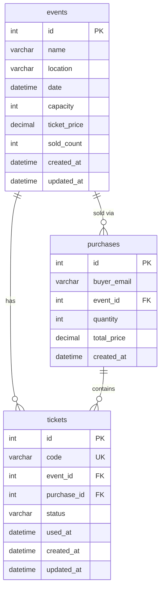
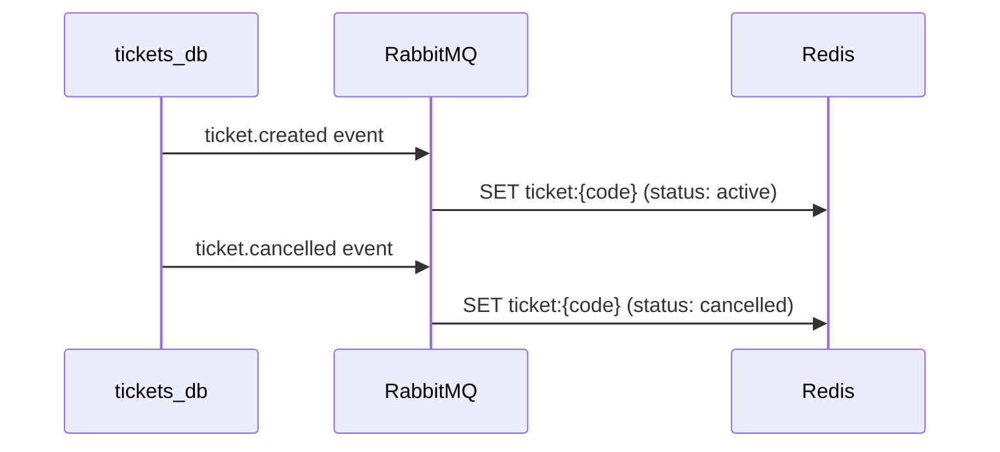

# Almacenamiento

Cada contexto acotado usa su propio almacenamiento: MySQL para la Ticket API, Redis para la Validator API.

---

## tickets_db (puerto 3306)

Usado por la **Ticket API** para almacenar eventos, compras y tickets.

### Diagrama ER



### Tablas

#### events

| Columna | Tipo | Restricciones | Descripción |
|---|---|---|---|
| `id` | `INT` | `PK AUTO_INCREMENT` | ID único del evento (asignado vía `LastInsertId()` después del insert) |
| `name` | `VARCHAR(255)` | `NOT NULL` | Nombre del evento |
| `location` | `VARCHAR(255)` | `NOT NULL` | Lugar |
| `date` | `DATETIME` | `NOT NULL` | Fecha y hora del evento |
| `capacity` | `INT` | `NOT NULL` | Máximo de tickets |
| `ticket_price` | `DECIMAL(10,2)` | `NOT NULL` | Precio por ticket |
| `sold_count` | `INT` | `DEFAULT 0` | Tickets vendidos |
| `created_at` | `DATETIME` | `DEFAULT NOW()` | Timestamp de creación |
| `updated_at` | `DATETIME` | `ON UPDATE NOW()` | Última actualización |

#### purchases

| Columna | Tipo | Restricciones | Descripción |
|---|---|---|---|
| `id` | `INT` | `PK AUTO_INCREMENT` | ID único de la compra |
| `buyer_email` | `VARCHAR(255)` | `NOT NULL` | Email del comprador |
| `event_id` | `INT` | `FK → events.id` | Referencia al evento |
| `quantity` | `INT` | `NOT NULL` | Cantidad de tickets |
| `total_price` | `DECIMAL(10,2)` | `NOT NULL` | Monto total |
| `created_at` | `DATETIME` | `DEFAULT NOW()` | Timestamp de creación |

#### tickets

| Columna | Tipo | Restricciones | Descripción |
|---|---|---|---|
| `id` | `INT` | `PK AUTO_INCREMENT` | ID único del ticket |
| `code` | `VARCHAR(36)` | `UNIQUE NOT NULL` | Código UUID para el QR |
| `event_id` | `INT` | `FK → events.id` | Referencia al evento |
| `purchase_id` | `INT` | `FK → purchases.id` | Referencia a la compra |
| `status` | `VARCHAR(20)` | `NOT NULL` | `emitted`, `used`, `cancelled` |
| `used_at` | `DATETIME` | `NULL` | Cuándo fue escaneado el ticket |
| `created_at` | `DATETIME` | `DEFAULT NOW()` | Timestamp de creación |
| `updated_at` | `DATETIME` | `ON UPDATE NOW()` | Última actualización |

---

## Redis (puerto 6379)

Usado por la **Validator API** como almacén clave-valor rápido para la validación de tickets en los puntos de acceso. Provee búsquedas O(1) por código de ticket.

### Formato de clave

```
ticket:{code}
```

Cada clave almacena un valor JSON:

```json
{
  "event_id": 10,
  "status": "active",
  "used_at": null,
  "synced_at": "2026-03-01T10:00:00Z",
  "updated_at": "2026-03-01T10:00:00Z"
}
```

| Campo | Tipo | Descripción |
|---|---|---|
| `event_id` | `int` | Referencia al evento |
| `status` | `string` | `active`, `used`, `cancelled` |
| `used_at` | `string?` | Timestamp RFC3339 del escaneo, o null |
| `synced_at` | `string` | Cuándo se sincronizó desde la Ticket API |
| `updated_at` | `string` | Timestamp de última actualización |

### Modelo de consistencia

Redis es una proyección **eventualmente consistente** de la tabla `tickets` (fuente de verdad):



Si un ticket aún no está en Redis, el Validator cae al fallback HTTP con un `POST /tickets/lookup` a la Ticket API y sincroniza el resultado en Redis.

!!! note "Idempotencia"
    El SET de Redis es naturalmente idempotente — eventos `ticket.created` duplicados simplemente sobreescriben la misma clave con el mismo valor.

---

## Migraciones

Los archivos SQL se encuentran en el directorio `migrations/` y se ejecutan automáticamente al iniciar el contenedor:

- `migrations/tickets_db.sql` — Esquema de tickets_db

Redis no requiere migraciones de esquema — las claves se crean dinámicamente por la aplicación.
