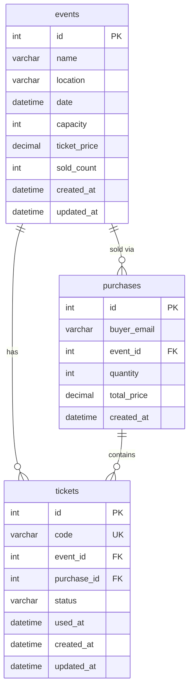
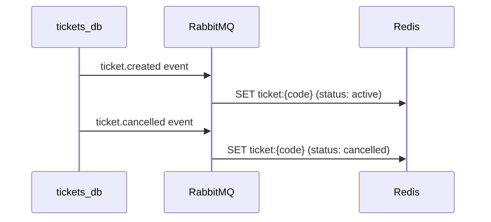

# Storage

Each bounded context uses its own storage: MySQL for the Ticket API, Redis for the Validator API.

---

## tickets_db (port 3306)

Used by the **Ticket API** to store events, purchases, and tickets.

### ER Diagram



### Tables

#### events

| Column | Type | Constraints | Description |
|---|---|---|---|
| `id` | `INT` | `PK AUTO_INCREMENT` | Unique event ID (assigned via `LastInsertId()` after insert) |
| `name` | `VARCHAR(255)` | `NOT NULL` | Event name |
| `location` | `VARCHAR(255)` | `NOT NULL` | Venue |
| `date` | `DATETIME` | `NOT NULL` | Event date/time |
| `capacity` | `INT` | `NOT NULL` | Max tickets |
| `ticket_price` | `DECIMAL(10,2)` | `NOT NULL` | Price per ticket |
| `sold_count` | `INT` | `DEFAULT 0` | Tickets sold |
| `created_at` | `DATETIME` | `DEFAULT NOW()` | Creation timestamp |
| `updated_at` | `DATETIME` | `ON UPDATE NOW()` | Last update |

#### purchases

| Column | Type | Constraints | Description |
|---|---|---|---|
| `id` | `INT` | `PK AUTO_INCREMENT` | Unique purchase ID |
| `buyer_email` | `VARCHAR(255)` | `NOT NULL` | Buyer email |
| `event_id` | `INT` | `FK → events.id` | Event reference |
| `quantity` | `INT` | `NOT NULL` | Number of tickets |
| `total_price` | `DECIMAL(10,2)` | `NOT NULL` | Total amount |
| `created_at` | `DATETIME` | `DEFAULT NOW()` | Creation timestamp |

#### tickets

| Column | Type | Constraints | Description |
|---|---|---|---|
| `id` | `INT` | `PK AUTO_INCREMENT` | Unique ticket ID |
| `code` | `VARCHAR(36)` | `UNIQUE NOT NULL` | UUID code for QR |
| `event_id` | `INT` | `FK → events.id` | Event reference |
| `purchase_id` | `INT` | `FK → purchases.id` | Purchase reference |
| `status` | `VARCHAR(20)` | `NOT NULL` | `emitted`, `used`, `cancelled` |
| `used_at` | `DATETIME` | `NULL` | When ticket was scanned |
| `created_at` | `DATETIME` | `DEFAULT NOW()` | Creation timestamp |
| `updated_at` | `DATETIME` | `ON UPDATE NOW()` | Last update |

---

## Redis (port 6379)

Used by the **Validator API** as a fast key-value store for ticket validation at entry points. Provides O(1) lookups by ticket code.

### Key Format

```
ticket:{code}
```

Each key stores a JSON value:

```json
{
  "event_id": 10,
  "status": "active",
  "used_at": null,
  "synced_at": "2026-03-01T10:00:00Z",
  "updated_at": "2026-03-01T10:00:00Z"
}
```

| Field | Type | Description |
|---|---|---|
| `event_id` | `int` | Event reference |
| `status` | `string` | `active`, `used`, `cancelled` |
| `used_at` | `string?` | RFC3339 timestamp when scanned, or null |
| `synced_at` | `string` | When synced from Ticket API |
| `updated_at` | `string` | Last update timestamp |

### Consistency Model

Redis is an **eventually consistent** projection of the source-of-truth `tickets` table:



If a ticket is not yet in Redis, the Validator falls back to an HTTP POST to the Ticket API (`POST /tickets/lookup`) and syncs the result to Redis.

!!! note "Idempotency"
    Redis SET is naturally idempotent — duplicate `ticket.created` events simply overwrite the same key with the same value.

---

## Migrations

SQL files are located in the `migrations/` directory and auto-executed on container startup:

- `migrations/tickets_db.sql` — Schema for tickets_db

Redis requires no schema migrations — keys are created dynamically by the application.
