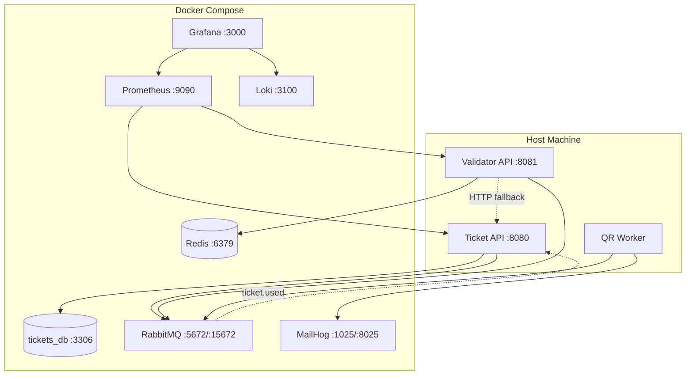

# Servicios Docker

Toda la infraestructura corre mediante Docker Compose. Los servicios de aplicación (Ticket API, Validator API, QR Worker) se ejecutan nativamente en el host.

---

## Mapa de servicios



---

## Servicios

### Infraestructura principal

| Servicio | Imagen | Puerto(s) | Propósito |
|---|---|---|---|
| `mysql-tickets` | `mysql:8.0` | `3306` | Base de datos de la Ticket API |
| `redis` | `redis:7-alpine` | `6379` | Almacenamiento de tickets para la Validator API (Redis) |
| `rabbitmq` | `rabbitmq:3-management` | `5672`, `15672` | Message broker + UI de administración |
| `mailhog` | `mailhog/mailhog` | `1025`, `8025` | Servidor SMTP de prueba + UI web |

### Stack de observabilidad

| Servicio | Imagen | Puerto | Propósito |
|---|---|---|---|
| `prometheus` | `prom/prometheus` | `9090` | Recolección y almacenamiento de métricas |
| `loki` | `grafana/loki` | `3100` | Agregación de logs |
| `grafana` | `grafana/grafana` | `3000` | Dashboards y visualización |

---

## Referencia rápida

### Iniciar todo

```bash
# Solo infraestructura
make infra
```

### Detener todo

```bash
make infra-down
```

### Puntos de acceso

| Servicio | URL |
|---|---|
| **RabbitMQ Management** | [http://localhost:15672](http://localhost:15672) (guest/guest) |
| **MailHog Web UI** | [http://localhost:8025](http://localhost:8025) |
| **Prometheus** | [http://localhost:9090](http://localhost:9090) |
| **Grafana** | [http://localhost:3000](http://localhost:3000) (admin/admin) |

---

## Volúmenes

| Volumen | Servicio | Propósito |
|---|---|---|
| `tickets-data` | mysql-tickets | Datos persistentes de la DB de tickets |
| `redis-data` | redis | Datos persistentes de Redis |
| `loki-data` | loki | Almacenamiento persistente de logs |

---

## Archivos de configuración

```
configs/
├── grafana/
│   ├── dashboards/
│   │   └── entradas-qr.json      # Dashboard pre-construido
│   └── provisioning/
│       ├── dashboards/
│       │   └── dashboards.yml     # Proveedor de dashboards
│       └── datasources/
│           └── datasources.yml    # Fuentes de datos Prometheus + Loki
├── loki/
│   └── loki-config.yml            # Configuración de almacenamiento de Loki
└── prometheus/
    └── prometheus.yml             # Configuración de targets de scraping
```
