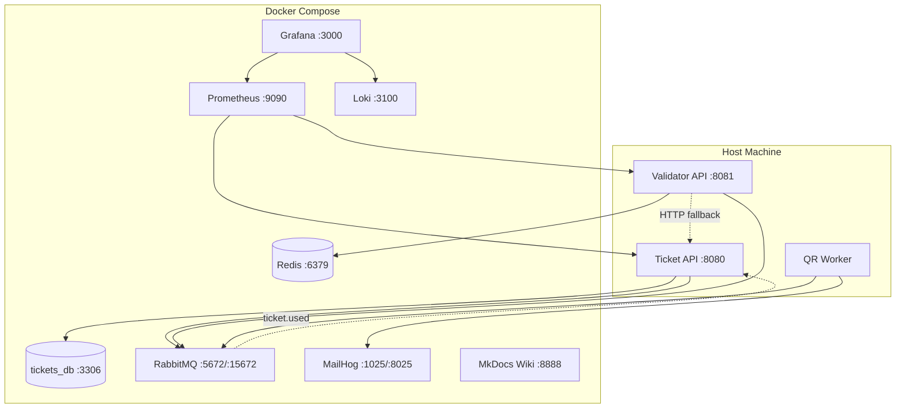

# Docker Services

All infrastructure runs via Docker Compose. Application services (Ticket API, Validator API, QR Worker) run natively on the host.

---

## Service Map



---

## Services

### Core Infrastructure

| Service | Image | Port(s) | Purpose |
|---|---|---|---|
| `mysql-tickets` | `mysql:8.0` | `3306` | Ticket API database |
| `redis` | `redis:7-alpine` | `6379` | Validator ticket storage (Redis) |
| `rabbitmq` | `rabbitmq:3-management` | `5672`, `15672` | Message broker + management UI |
| `mailhog` | `mailhog/mailhog` | `1025`, `8025` | SMTP test server + web UI |

### Observability Stack

| Service | Image | Port | Purpose |
|---|---|---|---|
| `prometheus` | `prom/prometheus` | `9090` | Metrics scraping & storage |
| `loki` | `grafana/loki` | `3100` | Log aggregation |
| `grafana` | `grafana/grafana` | `3000` | Dashboards & visualization |

### Documentation

| Service | Image | Port | Purpose |
|---|---|---|---|
| `wiki` | `squidfunk/mkdocs-material` | `8888` | Project documentation |

---

## Quick Reference

### Start Everything

```bash
# Infrastructure only
make infra

# With wiki
docker compose --profile docs up -d
```

### Stop Everything

```bash
make infra-down
```

### Access Points

| Service | URL |
|---|---|
| **RabbitMQ Management** | [http://localhost:15672](http://localhost:15672) (guest/guest) |
| **MailHog Web UI** | [http://localhost:8025](http://localhost:8025) |
| **Prometheus** | [http://localhost:9090](http://localhost:9090) |
| **Grafana** | [http://localhost:3000](http://localhost:3000) (admin/admin) |
| **Wiki** | [http://localhost:8888](http://localhost:8888) |

---

## Volumes

| Volume | Service | Purpose |
|---|---|---|
| `tickets-data` | mysql-tickets | Persistent ticket DB data |
| `redis-data` | redis | Persistent Redis data |
| `loki-data` | loki | Persistent log storage |

---

## Configuration Files

```
configs/
├── grafana/
│   ├── dashboards/
│   │   └── entradas-qr.json      # Pre-built dashboard
│   └── provisioning/
│       ├── dashboards/
│       │   └── dashboards.yml     # Dashboard provider
│       └── datasources/
│           └── datasources.yml    # Prometheus + Loki sources
├── loki/
│   └── loki-config.yml            # Loki storage config
└── prometheus/
    └── prometheus.yml             # Scrape targets config
```
