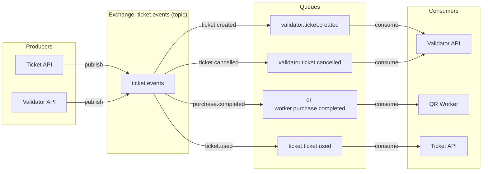

# RabbitMQ y Eventos

Configuración del message broker y detalles de la arquitectura orientada a eventos.

---

## Topología



---

## Exchange

| Propiedad | Valor |
|---|---|
| **Nombre** | `ticket.events` |
| **Tipo** | `topic` |
| **Durable** | `true` |
| **Auto-delete** | `false` |

---

## Colas y bindings

| Cola | Routing Key | Consumidor | Propósito |
|---|---|---|---|
| `validator.ticket.created` | `ticket.created` | Validator API | Sincronizar nuevos tickets a la DB local |
| `validator.ticket.cancelled` | `ticket.cancelled` | Validator API | Marcar tickets como cancelados localmente |
| `qr-worker.purchase.completed` | `purchase.completed` | QR Worker | Generar códigos QR y enviar email |
| `ticket.ticket.used` | `ticket.used` | Ticket API | Reconciliar estado del ticket (marcar como usado) |

Todas las colas son **durables** con **acknowledgment manual**.

---

## Esquemas de eventos

### ticket.created

Publicado una vez por ticket después de que se persiste una compra.

```json
{
  "TicketID": 42,
  "TicketCode": "a1b2c3d4-e5f6-7890-abcd-ef1234567890",
  "EventID": 1
}
```

### ticket.cancelled

Publicado cuando se cancela un ticket vía `POST /tickets/cancel`.

```json
{
  "TicketID": 42,
  "TicketCode": "a1b2c3d4-e5f6-7890-abcd-ef1234567890",
  "EventID": 1
}
```

### purchase.completed

Publicado una vez por compra después de que se crean todos los tickets. Contiene todos los datos que necesita el QR worker.

```json
{
  "PurchaseID": 7,
  "BuyerEmail": "john@example.com",
  "EventName": "Rock Festival 2026",
  "TicketCodes": [
    "a1b2c3d4-...",
    "b2c3d4e5-...",
    "c3d4e5f6-..."
  ]
}
```

### ticket.used

Publicado por la Validator API cuando un ticket se valida exitosamente en el venue. Habilita la reconciliación bidireccional.

```json
{
  "TicketCode": "a1b2c3d4-e5f6-7890-abcd-ef1234567890",
  "EventID": 1
}
```

---

## Patrones de consumo

### Idempotencia

Todos los consumidores manejan mensajes duplicados de forma correcta:

- **ticket.created** — Si ya existe un `ValidTicket` con el mismo código, el mensaje se acknowledgea sin error.
- **ticket.cancelled** — Si el ticket ya está cancelado o no se encuentra, el mensaje se acknowledgea.
- **ticket.used** — Si el ticket ya está marcado como usado, el mensaje se acknowledgea (no-op).

### Manejo de errores

| Escenario | Comportamiento |
|---|---|
| **Fallo de unmarshal** | `Nack(false, false)` — descarta el mensaje envenenado |
| **Error transitorio de DB** | `Nack(false, true)` — reencola para reintento |
| **Fallo de SMTP** (QR Worker) | `Nack(false, true)` — reencola para reintento |
| **Éxito** | `Ack(false)` |

---

## Configuración de conexión

Definida en `internal/platform/rabbitmq/connection.go`:

```go
// Topology is declared on startup by both services.
rabbitmq.SetupTopology(channel)
```

Esto garantiza que todos los exchanges, colas y bindings existen antes de que arranque cualquier productor o consumidor.

---

## Métricas

| Métrica | Labels | Descripción |
|---|---|---|
| `rabbitmq_events_published_total` | `routing_key` | Eventos publicados por Ticket API / Validator API |
| `rabbitmq_events_consumed_total` | `queue`, `status` | Eventos consumidos por Validator / QR Worker / Ticket API |
