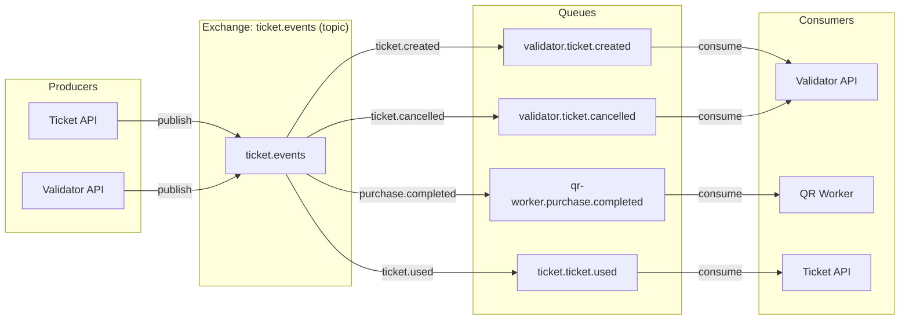

# RabbitMQ & Events

Message broker configuration and event-driven architecture details.

---

## Topology



---

## Exchange

| Property | Value |
|---|---|
| **Name** | `ticket.events` |
| **Type** | `topic` |
| **Durable** | `true` |
| **Auto-delete** | `false` |

---

## Queues & Bindings

| Queue | Routing Key | Consumer | Purpose |
|---|---|---|---|
| `validator.ticket.created` | `ticket.created` | Validator API | Sync new tickets to local DB |
| `validator.ticket.cancelled` | `ticket.cancelled` | Validator API | Mark tickets as cancelled locally |
| `qr-worker.purchase.completed` | `purchase.completed` | QR Worker | Generate QR codes & send email |
| `ticket.ticket.used` | `ticket.used` | Ticket API | Reconcile ticket status (mark as used) |

All queues are **durable** with **manual acknowledgment**.

---

## Event Schemas

### ticket.created

Published once per ticket after a purchase is persisted.

```json
{
  "TicketID": 42,
  "TicketCode": "a1b2c3d4-e5f6-7890-abcd-ef1234567890",
  "EventID": 1
}
```

### ticket.cancelled

Published when a ticket is cancelled via `POST /tickets/cancel`.

```json
{
  "TicketID": 42,
  "TicketCode": "a1b2c3d4-e5f6-7890-abcd-ef1234567890",
  "EventID": 1
}
```

### purchase.completed

Published once per purchase after all tickets are created. Contains all data needed by the QR worker.

```json
{
  "PurchaseID": 7,
  "BuyerEmail": "john@example.com",
  "EventName": "Rock Festival 2026",
  "TicketCodes": [
    "a1b2c3d4-...",
    "b2c3d4e5-...",
    "c3d4e5f6-..."
  ]
}
```

### ticket.used

Published by the Validator API when a ticket is successfully validated at the venue. Enables bidirectional reconciliation.

```json
{
  "TicketCode": "a1b2c3d4-e5f6-7890-abcd-ef1234567890",
  "EventID": 1
}
```

---

## Consumer Patterns

### Idempotency

All consumers handle duplicate messages gracefully:

- **ticket.created** — If a `ValidTicket` with the same code already exists, the message is acknowledged without error.
- **ticket.cancelled** — If the ticket is already cancelled or not found, the message is acknowledged.
- **ticket.used** — If the ticket is already marked as used, the message is acknowledged (no-op).

### Error Handling

| Scenario | Behavior |
|---|---|
| **Unmarshal failure** | `Nack(false, false)` — discard poison message |
| **Transient DB error** | `Nack(false, true)` — requeue for retry |
| **SMTP failure** (QR Worker) | `Nack(false, true)` — requeue for retry |
| **Success** | `Ack(false)` |

---

## Connection Setup

Defined in `internal/platform/rabbitmq/connection.go`:

```go
// Topology is declared on startup by both services.
rabbitmq.SetupTopology(channel)
```

This ensures all exchanges, queues, and bindings exist before any producer or consumer starts.

---

## Metrics

| Metric | Labels | Description |
|---|---|---|
| `rabbitmq_events_published_total` | `routing_key` | Events published by Ticket API / Validator API |
| `rabbitmq_events_consumed_total` | `queue`, `status` | Events consumed by Validator / QR Worker / Ticket API |
