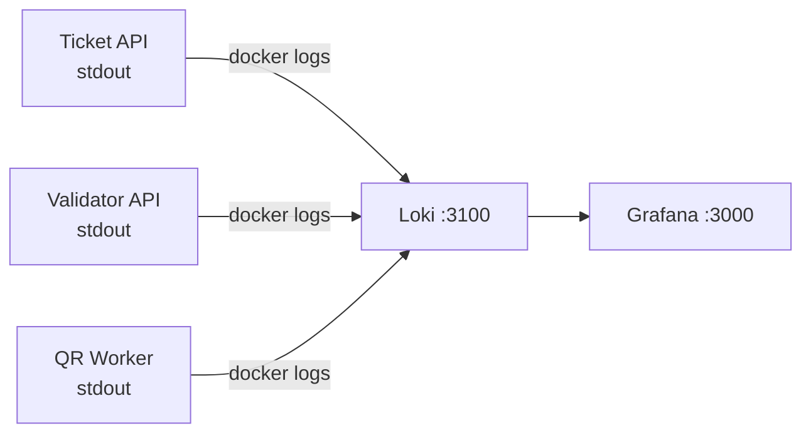

# Logs y Loki

Logging JSON estructurado con `slog` y agregación centralizada vía Loki.

---

## Librería de Logging

Ambos servicios usan el `log/slog` estándar de Go con salida JSON:

```go
logger := slog.New(slog.NewJSONHandler(os.Stdout, nil))
```

Todas las entradas de log son JSON estructurado escrito a stdout, haciéndolos compatibles con cualquier sistema de agregación de logs.

---

## Formato de Log

Cada línea de log es un objeto JSON:

```json
{
  "time": "2026-03-01T10:05:00.123Z",
  "level": "INFO",
  "msg": "purchase completed",
  "purchase_id": 1,
  "quantity": 3
}
```

---

## Puntos de Log

### Ticket API

| Level | Mensaje | Contexto | Cuándo |
|---|---|---|---|
| `INFO` | `event created` | `name`, `capacity` | Después de crear un evento |
| `INFO` | `purchase completed` | `purchase_id`, `quantity` | Después del flujo de compra |
| `ERROR` | `failed to create event` | `error` | Error de DB en insert de evento |
| `ERROR` | `unexpected error` | `error` | Error no controlado del servicio |

### Validator API

| Level | Mensaje | Contexto | Cuándo |
|---|---|---|---|
| `INFO` | `ticket validated` | `code`, `result` | Después de la validación |
| `ERROR` | `validation error` | `error` | Error de servicio/DB |
| `ERROR` | `ticket service fallback failed` | `error` | Fallo del fallback HTTP |

### QR Worker

| Level | Mensaje | Contexto | Cuándo |
|---|---|---|---|
| `INFO` | `processing purchase` | `purchase_id`, `buyer_email`, `tickets` | Mensaje recibido |
| `INFO` | `purchase processed successfully` | `purchase_id`, `qr_codes` | Email enviado |
| `ERROR` | `failed to generate QR` | `code`, `error` | Fallo en generación de QR |
| `ERROR` | `failed to send email, will retry` | `email`, `error` | Fallo SMTP (reencolado) |
| `ERROR` | `failed to unmarshal message` | `error` | Mensaje envenenado (descartado) |

### Consumidor RabbitMQ (Validator)

| Level | Mensaje | Contexto | Cuándo |
|---|---|---|---|
| `INFO` | `ticket synced (created)` | `code`, `event_id` | Evento de creación consumido |
| `INFO` | `ticket synced (cancelled)` | `code` | Evento de cancelación consumido |
| `ERROR` | `failed to process message` | `error` | Fallo en el procesamiento |

---

## Configuración de Loki

Loki corre como servicio Docker en el puerto `3100`. Configuración en `configs/loki/loki-config.yml`.

### Arquitectura



!!! tip "Desarrollo Local"
    Al correr los servicios de forma nativa (no en Docker), podés pipear los logs a Loki usando Promtail o simplemente verlos en la terminal. El datasource de Loki en Grafana está preconfigurado para cuando los servicios corren en Docker.

---

## Ejemplos de LogQL

### Todos los errores de ticket-api

```logql
{job="ticket-api"} |= "ERROR"
```

### Eventos de compra con cantidad

```logql
{job="ticket-api"} | json | msg="purchase completed" | quantity > 1
```

### Fallos de validación

```logql
{job="validator-api"} | json | msg="validation error"
```
