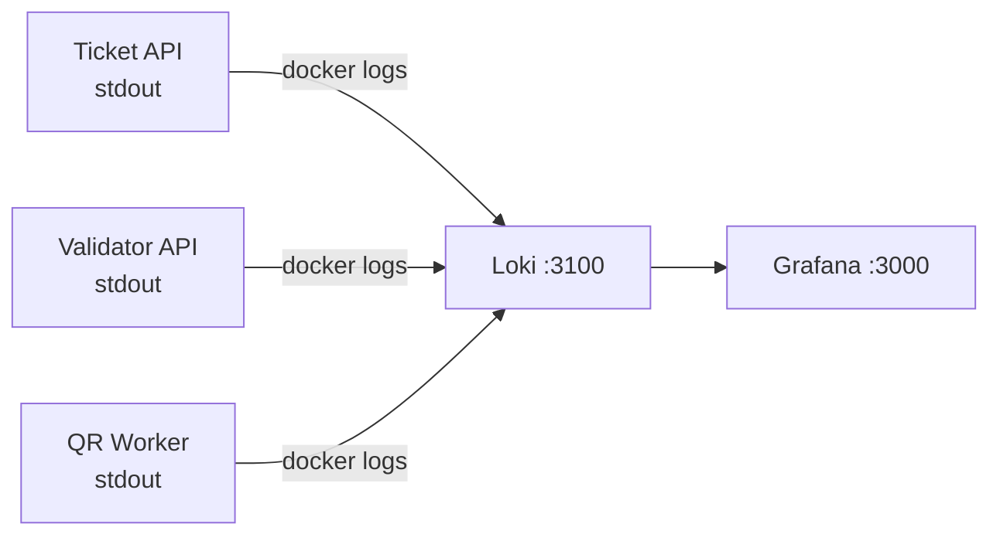

# Logs & Loki

Structured JSON logging with `slog` and centralized aggregation via Loki.

---

## Logging Library

Both services use Go's standard `log/slog` with JSON output:

```go
logger := slog.New(slog.NewJSONHandler(os.Stdout, nil))
```

All log entries are structured JSON written to stdout, making them compatible with any log aggregation system.

---

## Log Format

Every log line is a JSON object:

```json
{
  "time": "2026-03-01T10:05:00.123Z",
  "level": "INFO",
  "msg": "purchase completed",
  "purchase_id": 1,
  "quantity": 3
}
```

---

## Log Points

### Ticket API

| Level | Message | Context | When |
|---|---|---|---|
| `INFO` | `event created` | `name`, `capacity` | After event creation |
| `INFO` | `purchase completed` | `purchase_id`, `quantity` | After purchase flow |
| `ERROR` | `failed to create event` | `error` | DB error on event insert |
| `ERROR` | `unexpected error` | `error` | Unhandled service error |

### Validator API

| Level | Message | Context | When |
|---|---|---|---|
| `INFO` | `ticket validated` | `code`, `result` | After validation |
| `ERROR` | `validation error` | `error` | Service/DB error |
| `ERROR` | `ticket service fallback failed` | `error` | HTTP fallback failure |

### QR Worker

| Level | Message | Context | When |
|---|---|---|---|
| `INFO` | `processing purchase` | `purchase_id`, `buyer_email`, `tickets` | Message received |
| `INFO` | `purchase processed successfully` | `purchase_id`, `qr_codes` | Email sent |
| `ERROR` | `failed to generate QR` | `code`, `error` | QR generation failure |
| `ERROR` | `failed to send email, will retry` | `email`, `error` | SMTP failure (requeued) |
| `ERROR` | `failed to unmarshal message` | `error` | Poison message (discarded) |

### RabbitMQ Consumer (Validator)

| Level | Message | Context | When |
|---|---|---|---|
| `INFO` | `ticket synced (created)` | `code`, `event_id` | Created event consumed |
| `INFO` | `ticket synced (cancelled)` | `code` | Cancelled event consumed |
| `ERROR` | `failed to process message` | `error` | Processing failure |

---

## Loki Setup

Loki runs as a Docker service on port `3100`. Configuration in `configs/loki/loki-config.yml`.

### Architecture



!!! tip "Local Development"
    When running services natively (not in Docker), you can pipe logs to Loki using Promtail or simply view them in the terminal. Grafana's Loki datasource is pre-configured for when services run in Docker.

---

## LogQL Examples

### All errors from ticket-api

```logql
{job="ticket-api"} |= "ERROR"
```

### Purchase events with quantity

```logql
{job="ticket-api"} | json | msg="purchase completed" | quantity > 1
```

### Validation failures

```logql
{job="validator-api"} | json | msg="validation error"
```
