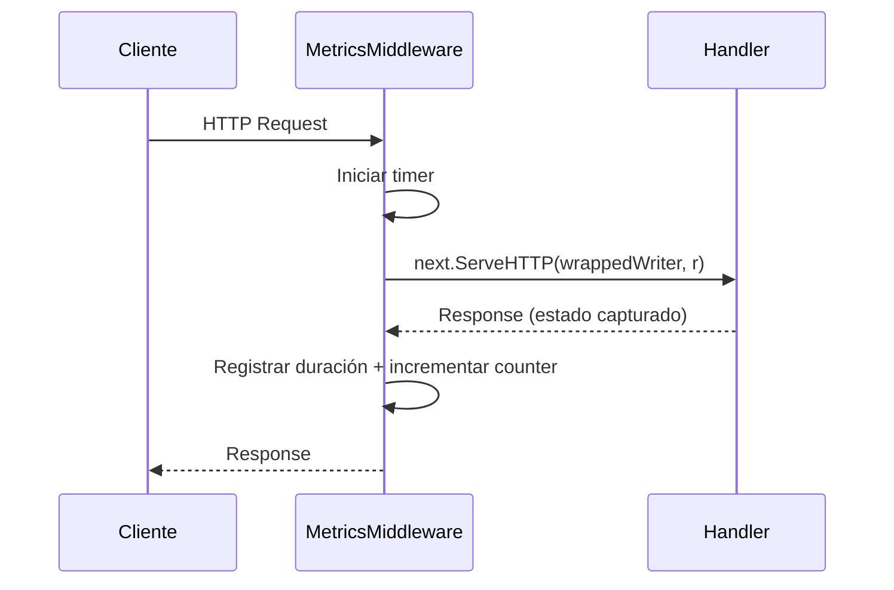

# Métricas y Prometheus

Métricas de aplicación personalizadas expuestas vía endpoint `/metrics` en ambos servicios.

---

## Endpoint de Métricas

| Servicio | URL |
|---|---|
| Ticket API | `http://localhost:8080/metrics` |
| Validator API | `http://localhost:8081/metrics` |

Ambos endpoints sirven métricas compatibles con Prometheus usando `promhttp.Handler()`.

---

## Métricas Personalizadas

### Métricas HTTP (ambos servicios)

Aplicadas automáticamente vía `HTTPMetricsMiddleware`.

| Métrica | Tipo | Labels | Descripción |
|---|---|---|---|
| `http_requests_total` | Counter | `method`, `path`, `status` | Total de requests HTTP |
| `http_request_duration_seconds` | Histogram | `method`, `path` | Distribución de latencia de requests |

### Métricas de Negocio — Ticket API

| Métrica | Tipo | Descripción |
|---|---|---|
| `events_created_total` | Counter | Eventos creados vía `POST /events` |
| `tickets_purchased_total` | Counter | Tickets comprados (incrementado por cantidad) |

### Métricas de Negocio — Validator API

| Métrica | Tipo | Labels | Descripción |
|---|---|---|---|
| `tickets_validated_total` | Counter | `result` (`valid`/`invalid`) | Resultados de validación de tickets |

### Métricas de Infraestructura

| Métrica | Tipo | Labels | Descripción |
|---|---|---|---|
| `rabbitmq_events_published_total` | Counter | `routing_key` | Eventos publicados en RabbitMQ |
| `rabbitmq_events_consumed_total` | Counter | `queue`, `status` | Eventos consumidos desde RabbitMQ |

---

## Configuración de Prometheus

Configuración de scrape en `configs/prometheus/prometheus.yml`:

```yaml
scrape_configs:
  - job_name: 'ticket-api'
    static_configs:
      - targets: ['host.docker.internal:8080']

  - job_name: 'validator-api'
    static_configs:
      - targets: ['host.docker.internal:8081']
```

!!! note
    `host.docker.internal` permite que Prometheus (ejecutándose en Docker) haga scraping de los servicios Go que corren en el host.

---

## Implementación del Middleware

El middleware de métricas HTTP envuelve cada request para capturar método, path, código de estado y duración:



El middleware usa un wrapper personalizado `responseWriter` que captura el código de estado escrito por los handlers downstream.

---

## Consultas PromQL Útiles

### Tasa de requests (últimos 5 min)

```promql
rate(http_requests_total[5m])
```

### Latencia P95

```promql
histogram_quantile(0.95, rate(http_request_duration_seconds_bucket[5m]))
```

### Tasa de errores

```promql
sum(rate(http_requests_total{status=~"5.."}[5m])) / sum(rate(http_requests_total[5m]))
```

### Tasa de éxito en validaciones

```promql
sum(rate(tickets_validated_total{result="valid"}[5m])) /
sum(rate(tickets_validated_total[5m]))
```
