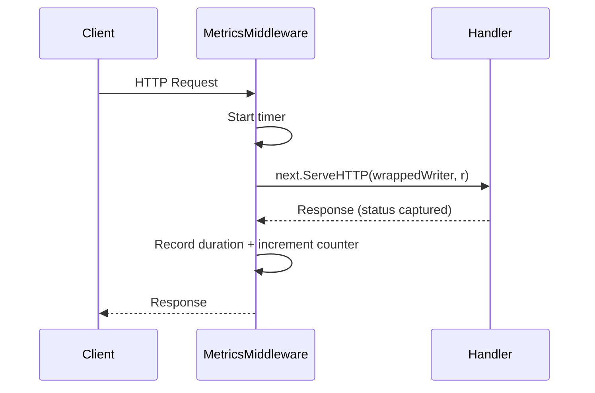

# Metrics & Prometheus

Custom application metrics exposed via `/metrics` endpoint on both services.

---

## Metrics Endpoint

| Service | URL |
|---|---|
| Ticket API | `http://localhost:8080/metrics` |
| Validator API | `http://localhost:8081/metrics` |

Both endpoints serve Prometheus-compatible metrics using `promhttp.Handler()`.

---

## Custom Metrics

### HTTP Metrics (both services)

Applied automatically via `HTTPMetricsMiddleware`.

| Metric | Type | Labels | Description |
|---|---|---|---|
| `http_requests_total` | Counter | `method`, `path`, `status` | Total HTTP requests |
| `http_request_duration_seconds` | Histogram | `method`, `path` | Request latency distribution |

### Business Metrics — Ticket API

| Metric | Type | Description |
|---|---|---|
| `events_created_total` | Counter | Events created via `POST /events` |
| `tickets_purchased_total` | Counter | Tickets purchased (incremented by quantity) |

### Business Metrics — Validator API

| Metric | Type | Labels | Description |
|---|---|---|---|
| `tickets_validated_total` | Counter | `result` (`valid`/`invalid`) | Ticket validation results |

### Infrastructure Metrics

| Metric | Type | Labels | Description |
|---|---|---|---|
| `rabbitmq_events_published_total` | Counter | `routing_key` | Events published to RabbitMQ |
| `rabbitmq_events_consumed_total` | Counter | `queue`, `status` | Events consumed from RabbitMQ |

---

## Prometheus Configuration

Scrape config in `configs/prometheus/prometheus.yml`:

```yaml
scrape_configs:
  - job_name: 'ticket-api'
    static_configs:
      - targets: ['host.docker.internal:8080']

  - job_name: 'validator-api'
    static_configs:
      - targets: ['host.docker.internal:8081']
```

!!! note
    `host.docker.internal` allows Prometheus (running in Docker) to scrape the Go services running on the host machine.

---

## Middleware Implementation

The HTTP metrics middleware wraps every request to capture method, path, status code, and duration:



The middleware uses a custom `responseWriter` wrapper that captures the status code written by downstream handlers.

---

## Useful PromQL Queries

### Request rate (last 5 min)

```promql
rate(http_requests_total[5m])
```

### P95 latency

```promql
histogram_quantile(0.95, rate(http_request_duration_seconds_bucket[5m]))
```

### Error rate

```promql
sum(rate(http_requests_total{status=~"5.."}[5m])) / sum(rate(http_requests_total[5m]))
```

### Validation success rate

```promql
sum(rate(tickets_validated_total{result="valid"}[5m])) /
sum(rate(tickets_validated_total[5m]))
```
